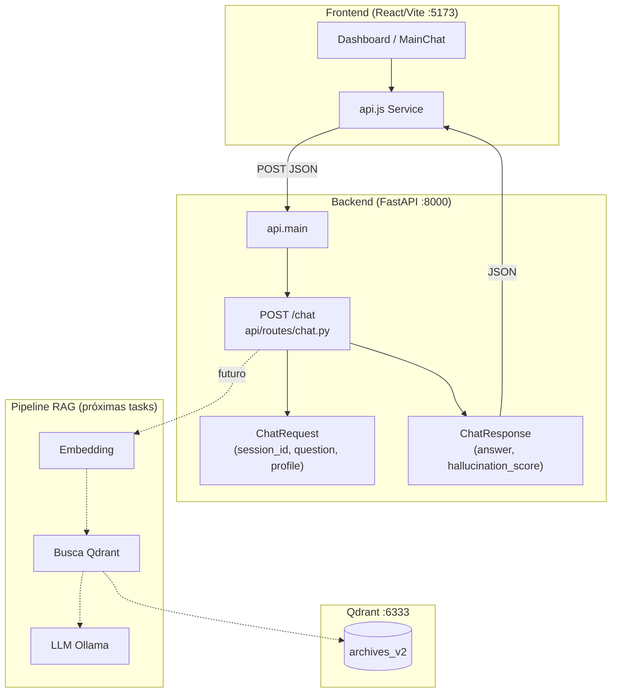
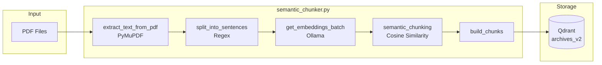
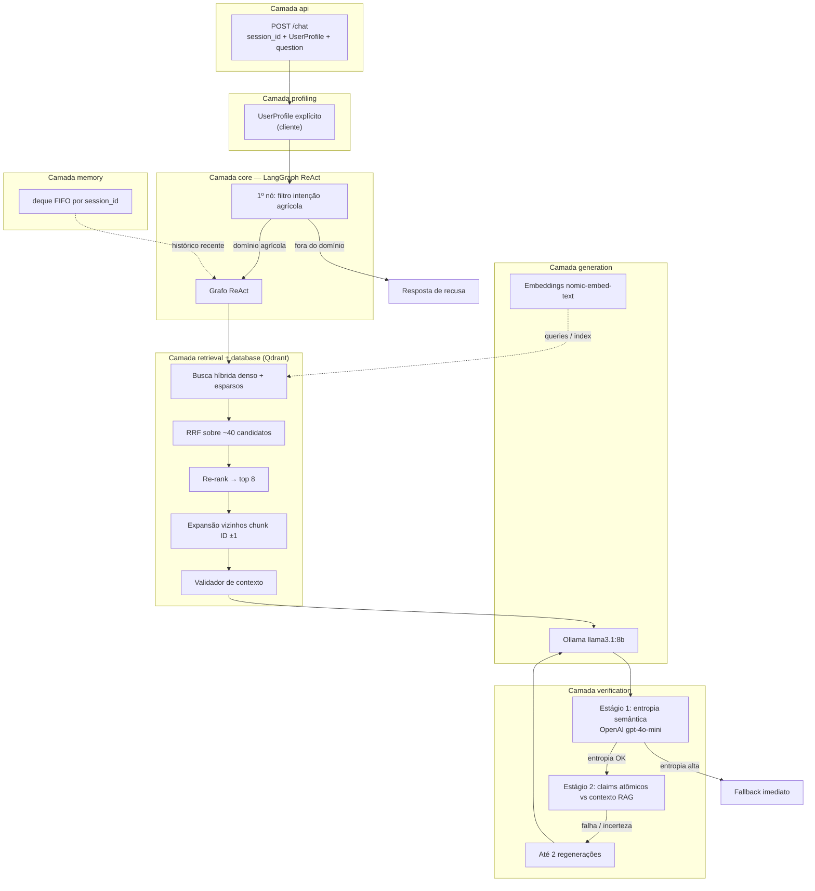
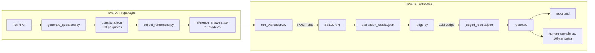

# ARCHITECTURE.md

Documento de auditoria arquitetural do sistema SmartB100 RAG.

## Diagrama de Fluxo - Estado Atual



> **Nota:** o handler atual de `POST /chat` valida o contrato Pydantic e retorna resposta **stub**. O encadeamento RAG (embedding → Qdrant → LLM) será integrado nas tasks seguintes.

### Pipeline de Indexação



## Stack Tecnológica

### Backend (Python 3.12+)

| Componente | Tecnologia | Versão | Função |
|------------|------------|--------|--------|
| API Framework | FastAPI | ≥0.111.0 | REST endpoints |
| Server | Uvicorn | ≥0.29.0 | ASGI server |
| Vector DB Client | qdrant-client | ≥1.9.0 | Interface Qdrant |
| PDF Extraction | PyMuPDF (fitz) | ≥1.24.0 | Extração de texto |
| Embeddings | Ollama | ≥0.2.0 | nomic-embed-text (768-dim) |
| LLM | Ollama | ≥0.2.0 | llama3.2:3b |
| Math | NumPy | ≥1.26.0 | Operações vetoriais |

### Frontend (Node.js 18+)

| Componente | Tecnologia | Versão | Função |
|------------|------------|--------|--------|
| Framework | React | 19.2.0 | UI components |
| Build Tool | Vite | 7.3.1 | Dev server + bundler |
| Linting | ESLint | 9.39.1 | Code quality |

### Infraestrutura

| Componente | Tecnologia | Porta | Função |
|------------|------------|-------|--------|
| Vector Database | Qdrant (Docker) | 6333/6334 | Armazenamento vetorial |
| LLM Runtime | Ollama | 11434 | Inferência local |

## Configuração de Chunking

```python
# database/semantic_chunker.py

OLLAMA_MODEL         = "nomic-embed-text"   # Modelo de embeddings
EMBED_DIM            = 768                   # Dimensão do vetor
SIMILARITY_THRESHOLD = 0.75                  # Threshold para novo chunk
MIN_CHUNK_SENTENCES  = 3                     # Mínimo de frases/chunk
MAX_CHUNK_SENTENCES  = 20                    # Máximo de frases/chunk
```

**Estratégia**: Chunking semântico baseado em similaridade de cosseno entre embeddings de frases consecutivas. Quando a similaridade cai abaixo de 0.75, um novo chunk é iniciado.

**Algoritmo**:
1. Extrai texto do PDF via PyMuPDF
2. Divide em frases via regex (`(?<=[.!?])\s+(?=[A-Z])`)
3. Gera embedding para cada frase
4. Agrupa frases com similaridade ≥ 0.75
5. Embedding do chunk = média dos embeddings das frases

## Configuração do Qdrant

```python
# Exemplo de constantes (indexação / busca — ver semantic_chunker.py)

QDRANT_URL  = "http://localhost:6333"
COLLECTION  = "archives_v2"
TOP_K       = 3
```

### Tipo de Busca: Apenas Densa

- **Vetor**: nomic-embed-text (768 dimensões)
- **Distância**: COSINE
- **Sparse Vectors**: NÃO IMPLEMENTADO
- **Late Interaction**: NÃO IMPLEMENTADO

```python
# Configuração da collection (semantic_chunker.py:188-191)
client.create_collection(
    collection_name=COLLECTION_NAME,
    vectors_config=VectorParams(size=embed_dim, distance=Distance.COSINE),
)
```

## Arquitetura do Agente

### Estado Atual: Pipeline Linear

```
Pergunta → Embedding → Busca Densa → Prompt + Contexto → LLM → Resposta
```

**Características**:
- Sem loops de validação
- Sem expansão de contexto
- Sem tool calling
- Sem ReAct pattern
- Sem LangGraph

```python
# api/routes/chat.py — contrato atual (resposta stub até integrar RAG)

@router.post("", response_model=ChatResponse)
async def chat(req: ChatRequest):
    return ChatResponse(answer="...", hallucination_score=0.0)
```

O pipeline linear histórico (embedding → busca densa → LLM) continua válido como **referência de design**; a implementação será acoplada ao handler `POST /chat` quando o RAG for migrado para este módulo.

## Target Architecture (MVP)

**Classificação:** feature — documentação de arquitetura-alvo do MVP.

Visão consolidada do estado-alvo do MVP **SmartB100 Squad5**, alinhada ao contexto do sprint atual. Complementa a auditoria do estado atual acima; detalhes de implementação ainda podem divergir do repositório até a entrega do MVP.

### Visão Geral

O sistema é um agente de suporte técnico agrícola baseado em RAG, orquestrado via **LangGraph** com padrão **ReAct**. A arquitetura-alvo organiza o código em **oito camadas modulares**: `api`, `core`, `retrieval`, `memory`, `profiling`, `generation`, `verification` e `database`.

### Camada de Entrada — API

- **Endpoint único:** `POST /chat`.
- **Corpo estruturado:** `session_id`, `UserProfile` e `question`.
- O perfil do usuário é **fornecido explicitamente pelo cliente** — não inferido pelo sistema (responsabilidade compartilhada entre **API** e **profiling**: validação/consumo do payload, sem Knowledge Graph no MVP).

### Orquestração — LangGraph ReAct

- O grafo do agente segue o padrão **ReAct**.
- O nó de **filtro de intenção agrícola** é **obrigatório** e o **primeiro nó** do grafo.
- Perguntas **fora do domínio agrícola** são interceptadas **antes** de recuperação ou geração, com **resposta de recusa** devolvida diretamente.

### Recuperação — Hybrid Search com RRF

- Modo **híbrido** (vetores **densos** + vetores **esparsos**) sobre **Qdrant** (camada **database**).
- **40** candidatos iniciais fundidos via **Reciprocal Rank Fusion (RRF)**, depois **re-ranking** para os **8** mais relevantes.
- Após a seleção final: **expansão de bordas** por chunk adjacente (**ID ±1**), incluindo chunks vizinhos no contexto recuperado.
- **Agente validador de contexto** após a recuperação: confirma pertinência dos chunks à pergunta **antes** da geração.

### Memória Conversacional

- Janela rolante com **`deque` FIFO**.
- Histórico recente por **`session_id`**, injetado no contexto de cada turno.

### Verificação de Alucinação — Dual Pipeline

O verificador opera em **dois estágios sequenciais**, com até **2 tentativas de regeneração**:

**Estágio 1 — Semantic Entropy:** várias respostas para a mesma pergunta; **clusterização semântica**; **entropia de Shannon** sobre a distribuição de clusters. Entropia **acima** do limiar configurado → **resposta de fallback imediata**, **sem** avançar ao estágio 2.

**Estágio 2 — Atomic Claim Verification:** só quando a entropia está **dentro** do limiar aceitável. **Afirmações atômicas** da resposta verificadas **individualmente** contra o contexto RAG recuperado.

A inferência **multi-chamada** do pipeline de entropia usa **OpenAI API** (`gpt-4o-mini` ou equivalente), **não** Ollama local, devido ao custo de latência de múltiplas chamadas sequenciais ao modelo local.

### Geração

- Resposta principal via **Ollama** com **`llama3.1:8b`**.
- **Embeddings** com **`nomic-embed-text`**.

### Fora de Escopo do MVP

- **GraphRAG**
- **Knowledge Graph** de perfil de produtor (ex.: Neo4j)
- **Logging estruturado** de alucinações

Itens acima permanecem em **roadmap**; não compõem o escopo do MVP atual.

### Diagrama de Fluxo (MVP Alvo)



> **Diagrama:** fluxo lógico alvo; nomes de módulos e limites entre camadas podem ser refinados na implementação.

## Comparativo: Atual vs MVP

| Aspecto | Atual | MVP |
|---------|-------|-----|
| **Busca** | Dense only | Híbrida (Dense + Sparse + RRF) |
| **Orquestração** | Pipeline linear | LangGraph ReAct |
| **Filtro de domínio** | Nenhum | Primeiro nó obrigatório |
| **Validação de contexto** | Nenhuma | Validador pré-geração |
| **Expansão de contexto** | Nenhuma | Vizinhos ±1 |
| **Memória** | Nenhuma | deque FIFO por sessão |
| **Verificação** | Nenhuma | Dual pipeline (entropia + claims) |
| **LLM** | llama3.2:3b | llama3.1:8b |
| **Regeneração** | Nenhuma | Até 2 tentativas |

---

## Pipeline de Avaliação Automatizado

Sistema de benchmark contínuo para medir qualidade das respostas do RAG contra modelos de referência.

### Diagrama do Pipeline



### Componentes

| Script | Função | Provider |
|--------|--------|----------|
| `generate_questions.py` | Gera perguntas de domínio agrícola a partir de documentos | Groq / Ollama |
| `collect_references.py` | Coleta respostas de modelos open-source (LLaMA, Mistral) | Groq / Ollama |
| `run_evaluation.py` | Executa perguntas contra `POST /chat` com session_id único | HTTP (httpx) |
| `judge.py` | Compara respostas com LLM juiz (alterna posição para evitar viés) | Groq / Ollama |
| `report.py` | Gera relatório MD e amostra CSV para validação humana | Local |

### Estrutura de Dados

```json
{
  "metadata": {
    "source_documents": ["boletim_sb100.pdf"],
    "generated_at": "ISO-8601",
    "total_questions": 300
  },
  "questions": [
    {
      "question_id": "uuid-v4",
      "question": "texto da pergunta",
      "reference_answers": [
        {
          "reference_model": "llama-3.1-8b-instant",
          "reference_answer": "texto da resposta"
        }
      ]
    }
  ]
}
```

### Métricas de Avaliação

| Métrica | Descrição |
|---------|-----------|
| `judge_score` | Score numérico (0-10) atribuído pelo LLM juiz |
| `judge_verdict` | Veredicto comparativo: `better` / `equivalent` / `worse` |
| `judge_justification` | Justificativa textual da avaliação |

### Mitigação de Viés

O script `judge.py` implementa alternância de posição (50%/50%) para evitar viés de ordem:
- 50% das comparações: SB100 na posição A, referência na posição B
- 50% das comparações: Referência na posição A, SB100 na posição B

### Execução

```bash
# 1. Gerar perguntas (requer PDF)
python eval/generate_questions.py ./archives/boletim.pdf --num-questions 300

# 2. Coletar respostas de referência
python eval/collect_references.py

# 3. Executar avaliação (API rodando)
python eval/run_evaluation.py

# 4. Julgar respostas
python eval/judge.py

# 5. Gerar relatório
python eval/report.py
```

Ver `eval/README.md` para documentação completa.

---

**Última atualização**: Adição do pipeline de avaliação automatizado
