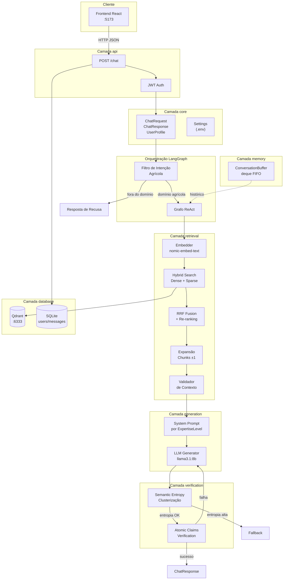
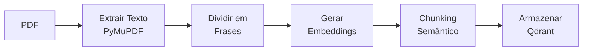

# ARCHITECTURE.md

Arquitetura do sistema SmartB100 — agente RAG para suporte técnico agrícola.

---

## Visão Geral

O SmartB100 é um sistema de perguntas e respostas especializado em agronomia, construído sobre a arquitetura RAG (Retrieval-Augmented Generation). O sistema recupera contexto relevante de documentos técnicos indexados e gera respostas adaptadas ao perfil do usuário.

A arquitetura é organizada em **oito camadas modulares**:

| Camada | Responsabilidade |
|--------|------------------|
| `api` | Endpoints REST e validação de contratos |
| `core` | Schemas Pydantic e configurações globais |
| `retrieval` | Embeddings e busca vetorial |
| `memory` | Histórico conversacional por sessão |
| `profiling` | Adaptação de respostas ao perfil do usuário |
| `generation` | Geração de respostas via LLM |
| `verification` | Detecção de alucinações |
| `database` | Persistência (SQLite + Qdrant) |

---

## Diagrama de Arquitetura



---

## Camadas em Detalhe

### 1. Camada API (`api/`)

Ponto de entrada do sistema. Expõe endpoints REST via FastAPI.

```
api/
├── main.py           # App FastAPI, CORS, lifespan
└── routes/
    ├── chat.py       # POST /chat — pipeline RAG principal
    ├── auth.py       # POST /auth/register, /auth/token
    └── health.py     # GET /health
```

**Endpoint principal:**

```python
POST /chat
{
    "session_id": "uuid",
    "question": "Como corrigir acidez do solo?",
    "profile": {
        "name": "João",
        "expertise": "beginner"  # beginner | intermediate | expert
    }
}
```

O `session_id` identifica a conversa para manter histórico. O `profile` determina a complexidade da resposta.

---

### 2. Camada Core (`core/`)

Define os contratos de dados e configurações do sistema.

```
core/
├── config.py         # Pydantic Settings (carrega .env)
└── schemas.py        # Modelos: ChatRequest, ChatResponse, UserProfile
```

**ExpertiseLevel** controla o tom das respostas:
- `beginner`: linguagem simples, exemplos práticos
- `intermediate`: termos técnicos com explicações breves
- `expert`: precisão técnica, dados quantitativos

---

### 3. Camada Retrieval (`retrieval/`)

Responsável por encontrar os trechos mais relevantes dos documentos indexados.

```
retrieval/
├── embedder.py       # Gera embeddings via Ollama
└── vector_store.py   # Busca no Qdrant
```

**Pipeline de Busca Híbrida:**

1. **Embedding da query** — converte a pergunta em vetor 768-dim
2. **Busca densa** — similaridade de cosseno no Qdrant
3. **Busca esparsa** — BM25 para termos exatos
4. **RRF (Reciprocal Rank Fusion)** — combina rankings dos dois métodos
5. **Re-ranking** — seleciona os 8 melhores de ~40 candidatos
6. **Expansão de bordas** — inclui chunks adjacentes (ID ±1)
7. **Validação** — confirma relevância antes de passar ao LLM

---

### 4. Camada Memory (`memory/`)

Mantém o histórico de conversas para contexto multi-turno.

```
memory/
├── conversation.py   # ConversationBuffer com deque FIFO
└── __init__.py
```

**ConversationBuffer:**

```python
buffer = ConversationBuffer(maxlen=10)
buffer.add("user", "Qual o pH ideal?")
buffer.add("assistant", "Entre 6.0 e 7.0...")
history = buffer.to_messages()  # Lista para injetar no LLM
```

Usa `collections.deque` com `maxlen` para descartar automaticamente turnos antigos (FIFO).

---

### 5. Camada Generation (`generation/`)

Gera respostas usando LLM local via Ollama.

```
generation/
├── llm.py            # Função generate() com system prompts
└── __init__.py
```

**Fluxo:**

1. Monta `messages[]` com system prompt baseado no perfil
2. Injeta histórico da conversa
3. Adiciona pergunta atual com contexto RAG
4. Chama `ollama.chat()` com o modelo configurado

```python
generate(
    question="Como corrigir acidez?",
    context="Texto dos chunks recuperados...",
    history=[{"role": "user", "content": "..."}],
    profile=UserProfile(name="João", expertise="beginner")
)
```

---

### 6. Camada Verification (`semantic_entropy/`)

Detecta alucinações através de dois estágios sequenciais.

```
semantic_entropy/
├── compute_entropy.py        # Orquestrador do pipeline
├── response_generator.py     # Gera múltiplas respostas
├── similarity_clustering.py  # Agrupa por similaridade
└── shannon_entropy.py        # Calcula entropia
```

**Estágio 1 — Semantic Entropy:**
- Gera N respostas para a mesma pergunta
- Agrupa por similaridade semântica (clustering)
- Calcula entropia de Shannon sobre a distribuição
- Entropia alta = incerteza = possível alucinação

**Estágio 2 — Atomic Claim Verification:**
- Decompõe a resposta em afirmações atômicas
- Verifica cada afirmação contra o contexto RAG
- Afirmações não suportadas = alucinação

Se falhar, regenera a resposta (até 2 tentativas).

---

### 7. Camada Database (`database/`)

Persistência de dados estruturados e vetoriais.

```
database/
├── db.py                 # SQLAlchemy engine + session
├── models.py             # User, Conversation, Message
└── semantic_chunker.py   # CLI de indexação de PDFs
```

**Qdrant (Vetorial):**
- Collection: `archives_v2`
- Dimensão: 768 (nomic-embed-text)
- Distância: COSINE

**SQLite (Relacional):**
- Tabelas: `users`, `conversations`, `messages`
- Autenticação JWT com hash bcrypt

---

### 8. Pipeline de Indexação

Processa PDFs e armazena chunks semânticos no Qdrant.



**Chunking Semântico:**
- Agrupa frases consecutivas com similaridade ≥ 0.75
- Mínimo 3 frases, máximo 20 por chunk
- Embedding do chunk = média dos embeddings das frases

```bash
# Indexar documentos
python database/semantic_chunker.py index ./archives/

# Testar busca
python database/semantic_chunker.py search "calagem"
```

---

## Pipeline de Avaliação

Sistema automatizado para medir qualidade das respostas.

```mermaid
flowchart LR
    subgraph PREP["Preparação"]
        PDF["Documentos"] --> GEN["generate_questions.py"]
        GEN --> QUESTIONS["questions.json"]
        QUESTIONS --> COLLECT["collect_references.py"]
        COLLECT --> REFS["reference_answers.json"]
    end

    subgraph EXEC["Execução"]
        REFS --> RUN["run_evaluation.py"]
        RUN --> API["POST /chat"]
        API --> RESULTS["evaluation_results.json"]
        RESULTS --> JUDGE["judge.py"]
        JUDGE --> JUDGED["judged_results.json"]
        JUDGED --> REPORT["report.py"]
        REPORT --> MD["report.md"]
    end
```



**Componentes:**

| Script | Função | Providers |
|--------|--------|-----------|
| `generate_questions.py` | Gera perguntas a partir de PDFs | Groq, Ollama, OpenRouter |
| `collect_references.py` | Coleta respostas de referência | Groq, Ollama, OpenRouter |
| `run_evaluation.py` | Executa perguntas contra a API | HTTP |
| `judge.py` | Compara respostas (LLM-as-judge) | Groq, Ollama, OpenRouter |
| `report.py` | Gera relatório final | Local |

**Mitigação de Viés:**
O juiz alterna a posição das respostas (50% SB100 primeiro, 50% referência primeiro) para evitar viés de ordem.

---

## Stack Tecnológica

### Backend

| Componente | Tecnologia | Função |
|------------|------------|--------|
| Framework | FastAPI | REST API |
| LLM | Ollama (llama3.1:8b) | Geração de respostas |
| Embeddings | Ollama (nomic-embed-text) | Vetorização 768-dim |
| Vector DB | Qdrant | Busca semântica |
| SQL DB | SQLite + SQLAlchemy | Users, conversations |
| Auth | PyJWT + bcrypt | Autenticação JWT |

### Frontend

| Componente | Tecnologia | Função |
|------------|------------|--------|
| Framework | React 19 | Interface do chat |
| Build | Vite | Dev server + bundler |
| State | Custom hooks | useChat, AuthContext |

### Infraestrutura

| Serviço | Porta | Função |
|---------|-------|--------|
| FastAPI | 8000 | Backend API |
| React/Vite | 5173 | Frontend dev |
| Qdrant | 6333 | Vector database |
| Ollama | 11434 | LLM inference |

---

## Configuração

Variáveis de ambiente (`.env`):

```bash
# Modelos
CHAT_MODEL=llama3.1:8b
EMBED_MODEL=nomic-embed-text

# Qdrant
QDRANT_URL=http://localhost:6333
COLLECTION_NAME=archives_v2
TOP_K=3

# Verificação
HALLUCINATION_THRESHOLD=0.5
VERIFICATION_ENABLED=true

# Auth
JWT_SECRET_KEY=your-secret-key

# APIs externas (eval pipeline)
GROQ_API_KEY=
OPENROUTER_API_KEY=
```

---

## Fora de Escopo

Itens planejados para versões futuras:

- **GraphRAG** — grafo de conhecimento sobre entidades agrícolas
- **Knowledge Graph de Produtores** — Neo4j para perfis detalhados
- **Logging Estruturado de Alucinações** — analytics sobre falhas
- **Streaming de Respostas** — SSE para respostas incrementais
