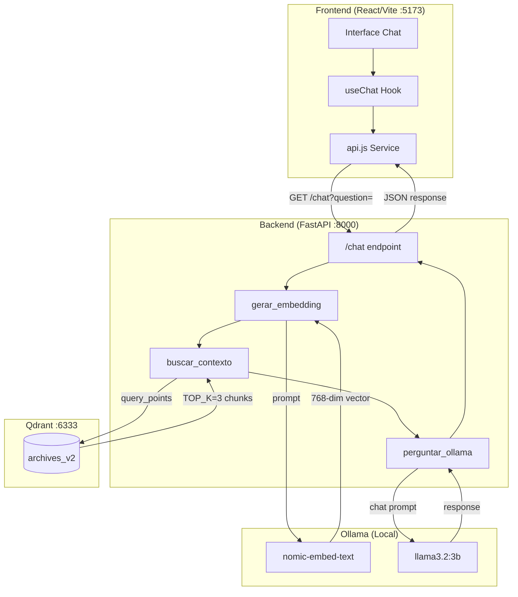
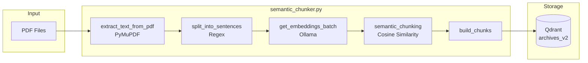
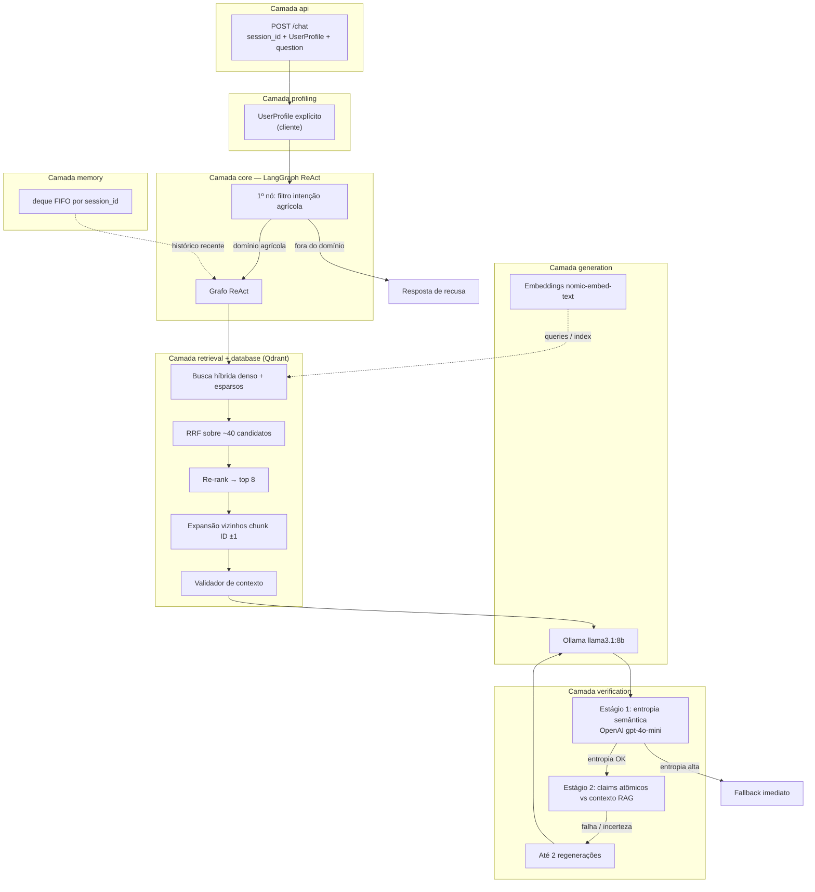
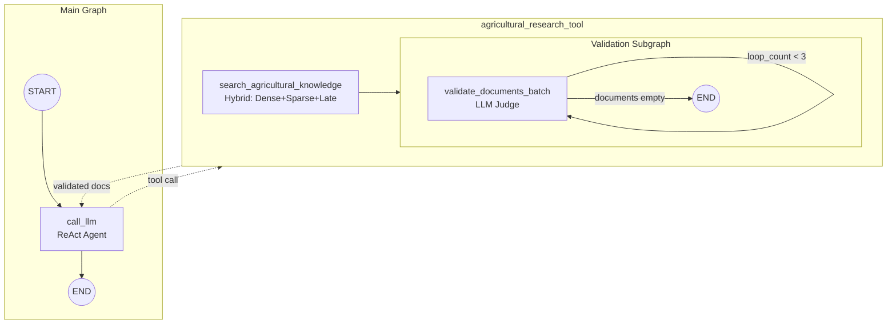
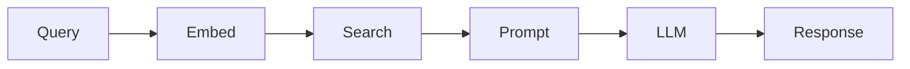
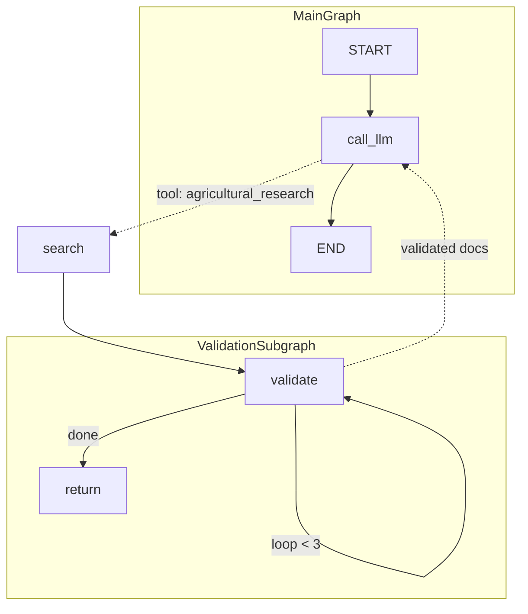

# ARCHITECTURE.md

Documento de auditoria arquitetural do sistema SmartB100 RAG.

## Diagrama de Fluxo - Estado Atual



### Pipeline de Indexação



## Stack Tecnológica

### Backend (Python 3.12+)

| Componente | Tecnologia | Versão | Função |
|------------|------------|--------|--------|
| API Framework | FastAPI | ≥0.111.0 | REST endpoints |
| Server | Uvicorn | ≥0.29.0 | ASGI server |
| Vector DB Client | qdrant-client | ≥1.9.0 | Interface Qdrant |
| PDF Extraction | PyMuPDF (fitz) | ≥1.24.0 | Extração de texto |
| Embeddings | Ollama | ≥0.2.0 | nomic-embed-text (768-dim) |
| LLM | Ollama | ≥0.2.0 | llama3.2:3b |
| Math | NumPy | ≥1.26.0 | Operações vetoriais |

### Frontend (Node.js 18+)

| Componente | Tecnologia | Versão | Função |
|------------|------------|--------|--------|
| Framework | React | 19.2.0 | UI components |
| Build Tool | Vite | 7.3.1 | Dev server + bundler |
| Linting | ESLint | 9.39.1 | Code quality |

### Infraestrutura

| Componente | Tecnologia | Porta | Função |
|------------|------------|-------|--------|
| Vector Database | Qdrant (Docker) | 6333/6334 | Armazenamento vetorial |
| LLM Runtime | Ollama | 11434 | Inferência local |

## Configuração de Chunking

```python
# database/semantic_chunker.py

OLLAMA_MODEL         = "nomic-embed-text"   # Modelo de embeddings
EMBED_DIM            = 768                   # Dimensão do vetor
SIMILARITY_THRESHOLD = 0.75                  # Threshold para novo chunk
MIN_CHUNK_SENTENCES  = 3                     # Mínimo de frases/chunk
MAX_CHUNK_SENTENCES  = 20                    # Máximo de frases/chunk
```

**Estratégia**: Chunking semântico baseado em similaridade de cosseno entre embeddings de frases consecutivas. Quando a similaridade cai abaixo de 0.75, um novo chunk é iniciado.

**Algoritmo**:
1. Extrai texto do PDF via PyMuPDF
2. Divide em frases via regex (`(?<=[.!?])\s+(?=[A-Z])`)
3. Gera embedding para cada frase
4. Agrupa frases com similaridade ≥ 0.75
5. Embedding do chunk = média dos embeddings das frases

## Configuração do Qdrant

```python
# agents/agent.py

QDRANT_URL  = "http://localhost:6333"
COLLECTION  = "archives_v2"
TOP_K       = 3
```

### Tipo de Busca: Apenas Densa

- **Vetor**: nomic-embed-text (768 dimensões)
- **Distância**: COSINE
- **Sparse Vectors**: NÃO IMPLEMENTADO
- **Late Interaction**: NÃO IMPLEMENTADO

```python
# Configuração da collection (semantic_chunker.py:188-191)
client.create_collection(
    collection_name=COLLECTION_NAME,
    vectors_config=VectorParams(size=embed_dim, distance=Distance.COSINE),
)
```

## Arquitetura do Agente

### Estado Atual: Pipeline Linear

```
Pergunta → Embedding → Busca Densa → Prompt + Contexto → LLM → Resposta
```

**Características**:
- Sem loops de validação
- Sem expansão de contexto
- Sem tool calling
- Sem ReAct pattern
- Sem LangGraph

```python
# agents/agent.py - Fluxo completo

@app.get("/chat")
def chat(question: str):
    context = buscar_contexto(question)    # 1. Busca densa (TOP_K=3)
    answer  = perguntar_ollama(question, context)  # 2. LLM direto
    return {"question": question, "answer": answer}
```

## Target Architecture (MVP)

**Classificação:** feature — documentação de arquitetura-alvo do MVP.

Visão consolidada do estado-alvo do MVP **SmartB100 Squad5**, alinhada ao contexto do sprint atual. Complementa a auditoria do estado atual acima; detalhes de implementação ainda podem divergir do repositório até a entrega do MVP.

### Visão Geral

O sistema é um agente de suporte técnico agrícola baseado em RAG, orquestrado via **LangGraph** com padrão **ReAct**. A arquitetura-alvo organiza o código em **oito camadas modulares**: `api`, `core`, `retrieval`, `memory`, `profiling`, `generation`, `verification` e `database`.

### Camada de Entrada — API

- **Endpoint único:** `POST /chat`.
- **Corpo estruturado:** `session_id`, `UserProfile` e `question`.
- O perfil do usuário é **fornecido explicitamente pelo cliente** — não inferido pelo sistema (responsabilidade compartilhada entre **API** e **profiling**: validação/consumo do payload, sem Knowledge Graph no MVP).

### Orquestração — LangGraph ReAct

- O grafo do agente segue o padrão **ReAct**.
- O nó de **filtro de intenção agrícola** é **obrigatório** e o **primeiro nó** do grafo.
- Perguntas **fora do domínio agrícola** são interceptadas **antes** de recuperação ou geração, com **resposta de recusa** devolvida diretamente.

### Recuperação — Hybrid Search com RRF

- Modo **híbrido** (vetores **densos** + vetores **esparsos**) sobre **Qdrant** (camada **database**).
- **40** candidatos iniciais fundidos via **Reciprocal Rank Fusion (RRF)**, depois **re-ranking** para os **8** mais relevantes.
- Após a seleção final: **expansão de bordas** por chunk adjacente (**ID ±1**), incluindo chunks vizinhos no contexto recuperado.
- **Agente validador de contexto** após a recuperação: confirma pertinência dos chunks à pergunta **antes** da geração.

### Memória Conversacional

- Janela rolante com **`deque` FIFO**.
- Histórico recente por **`session_id`**, injetado no contexto de cada turno.

### Verificação de Alucinação — Dual Pipeline

O verificador opera em **dois estágios sequenciais**, com até **2 tentativas de regeneração**:

**Estágio 1 — Semantic Entropy:** várias respostas para a mesma pergunta; **clusterização semântica**; **entropia de Shannon** sobre a distribuição de clusters. Entropia **acima** do limiar configurado → **resposta de fallback imediata**, **sem** avançar ao estágio 2.

**Estágio 2 — Atomic Claim Verification:** só quando a entropia está **dentro** do limiar aceitável. **Afirmações atômicas** da resposta verificadas **individualmente** contra o contexto RAG recuperado.

A inferência **multi-chamada** do pipeline de entropia usa **OpenAI API** (`gpt-4o-mini` ou equivalente), **não** Ollama local, devido ao custo de latência de múltiplas chamadas sequenciais ao modelo local.

### Geração

- Resposta principal via **Ollama** com **`llama3.1:8b`**.
- **Embeddings** com **`nomic-embed-text`**.

### Fora de Escopo do MVP

- **GraphRAG**
- **Knowledge Graph** de perfil de produtor (ex.: Neo4j)
- **Logging estruturado** de alucinações

Itens acima permanecem em **roadmap**; não compõem o escopo do MVP atual.

### Diagrama de Fluxo (MVP Alvo)



> **Diagrama:** fluxo lógico alvo; nomes de módulos e limites entre camadas podem ser refinados na implementação.

## Estrutura de Diretórios

```
sb100_agents/
├── agents/
│   └── agent.py                 # API FastAPI, endpoints /chat e /health
│
├── database/
│   └── semantic_chunker.py      # Pipeline de indexação: PDF → chunks → Qdrant
│
├── frontend/smartb100/
│   ├── src/
│   │   ├── App.jsx              # Componente raiz, toggle StartScreen/ChatScreen
│   │   ├── components/
│   │   │   ├── ChatScreen.jsx   # Interface de chat
│   │   │   ├── StartScreen.jsx  # Tela inicial
│   │   │   └── index.js         # Barrel exports
│   │   ├── hooks/
│   │   │   └── useChat.js       # Estado do chat, histórico, loading
│   │   └── services/
│   │       └── api.js           # Cliente HTTP (fetch wrapper)
│   └── vite.config.js           # Proxy /api → localhost:8000
│
├── archives/                     # PDFs fonte para indexação
├── qdrant_storage/              # Volume persistente Qdrant
│
├── docker-compose.yml           # Serviço Qdrant
├── package.json                 # Scripts npm (start, api, frontend)
├── pyproject.toml               # Dependências Python (uv)
└── README.md                    # Documentação de setup
```

## Gap Analysis: sb100_agents vs. Arquitetura Planejada (new_project)

### Comparativo de Funcionalidades

| Feature | sb100_agents (Atual) | new_project (Planejado) | Gap |
|---------|---------------------|------------------------|-----|
| **Busca** | Dense only (nomic-embed-text) | Hybrid (Dense + Sparse + Late) | Falta BM25 + ColBERT |
| **Orquestração** | Pipeline linear | LangGraph + ReAct | Sem agente inteligente |
| **Validação** | Nenhuma | Subgraph com 3 loops max | Sem validação de relevância |
| **Expansão** | Nenhuma | Expansão proativa de vizinhos | Sem context expansion |
| **LLM Provider** | Ollama local | Groq cloud | Decisão pendente |
| **Embeddings** | Ollama nomic-embed-text | FastEmbed (MiniLM + BM25 + ColBERT) | Modelo pendente |
| **Token Tracking** | Não | Sim (input/output) | Sem métricas |

### Arquitetura Planejada (new_project)



## Comparação Detalhada: sb100_agents vs new_project

### Visão Geral dos Repositórios

| Aspecto | sb100_agents | new_project |
|---------|--------------|-------------|
| **Propósito** | Sistema RAG de produção com frontend | Pipeline de ingestão e agente avançado |
| **Python** | 3.12+ | 3.13+ |
| **Frontend** | React 19 + Vite 7 | Nenhum (API only) |
| **Complexidade** | Simples, linear | Avançado, com loops |
| **Estado** | MVP funcional | Experimento/referência |

### Comparação de Stack Tecnológica

#### Backend

| Componente | sb100_agents | new_project |
|------------|--------------|-------------|
| **API Framework** | FastAPI 0.111.0+ | FastAPI 0.115.6+ |
| **PDF Extraction** | PyMuPDF (fitz) | Docling 2.70.0+ (layout-aware) |
| **PDF Fallback** | - | PyPDF2 3.0.1 |
| **Vision/Tables** | - | Google Gemini (VLM) |
| **Embeddings** | Ollama (nomic-embed-text) | FastEmbed 0.7.4+ |
| **LLM Provider** | Ollama local | Groq cloud (langchain-groq) |
| **Orchestration** | Nenhuma | LangGraph 1.0.7+ |
| **Structured Output** | - | Pydantic-AI 1.48.0 |

#### Dependências Python

```
# sb100_agents/pyproject.toml          # new_project/pyproject.toml
fastapi>=0.111.0                       fastapi>=0.115.6
pymupdf>=1.24.0                        docling>=2.70.0
ollama>=0.2.0                          fastembed>=0.7.4
qdrant-client>=1.9.0                   qdrant-client>=1.16.2
numpy>=1.26.0                          langchain-groq>=1.1.1
sentence-transformers>=2.7.0           langgraph>=1.0.7
                                       pydantic-ai>=1.48.0
                                       google-genai>=1.60.0
```

### Comparação de Estratégias de Embedding

#### sb100_agents (Atual)

```python
# Modelo único via Ollama
OLLAMA_MODEL = "nomic-embed-text"
EMBED_DIM    = 768

def get_embedding(text: str) -> np.ndarray:
    response = ollama.embeddings(model=OLLAMA_MODEL, prompt=text)
    return np.array(response["embedding"])
```

**Características**:
- Single-vector (dense only)
- Inferência local via Ollama
- 768 dimensões
- Sem dependência de API externa

#### new_project (Referência)

```python
# Três modelos via FastEmbed
dense_model  = TextEmbedding("sentence-transformers/all-MiniLM-L6-v2")
sparse_model = SparseTextEmbedding("Qdrant/bm25")
late_model   = LateInteractionTextEmbedding("colbert-ir/colbertv2.0")
```

**Características**:
- Multi-vector (dense + sparse + late-interaction)
- FastEmbed (local, otimizado)
- Dense: 384 dims | Sparse: IDF | Late: multi-vector
- Fusion via RRF (Reciprocal Rank Fusion)

### Comparação de Estratégias de Busca

#### sb100_agents: Busca Densa Simples

```python
# agents/agent.py
def buscar_contexto(question: str) -> str:
    embedding = gerar_embedding(question)
    resultados = qdrant.query_points(
        collection_name=COLLECTION,
        query=embedding,
        limit=TOP_K,  # 3
        with_payload=True,
    ).points
    return "\n\n".join([r.payload.get("text", "") for r in resultados])
```

**Fluxo**:
```
Query → Dense Embedding → Qdrant (COSINE) → Top 3 → Concatena
```

#### new_project: Busca Híbrida com Fusion

```python
# agent.py
def search_agricultural_knowledge(query: str) -> list[tuple[int, str]]:
    prefetches = []

    # Dense
    dense_query = next(dense_model.embed([query])).tolist()
    prefetches.append(models.Prefetch(query=dense_query, using="all-MiniLM-L6-v2", limit=20))

    # Sparse (BM25)
    sparse_query = next(sparse_model.embed([query]))
    prefetches.append(models.Prefetch(query=sparse_query.as_object(), using="bm25", limit=20))

    # Late Interaction (ColBERT)
    if late_model:
        late_query = next(late_model.embed([query]))
        prefetches.append(models.Prefetch(query=late_query, using="colbertv2.0", limit=20))

    # Fusion
    search_result = client.query_points(
        collection_name=COLLECTION_NAME,
        prefetch=prefetches,
        query=models.FusionQuery(fusion=models.Fusion.RRF),
        limit=8,
    )
```

**Fluxo**:
```
Query → [Dense + Sparse + Late] → Prefetch (20 cada) → RRF Fusion → Top 8
```

### Comparação de Arquitetura do Agente

#### sb100_agents: Pipeline Linear



```python
@app.get("/chat")
def chat(question: str):
    context = buscar_contexto(question)       # Busca direta
    answer = perguntar_ollama(question, context)  # LLM direto
    return {"answer": answer}
```

**Limitações**:
- Sem validação de relevância
- Sem expansão de contexto
- Sem retry/loop
- Confia cegamente no TOP_K

#### new_project: LangGraph com Validação



```python
# StateGraph com validação
class SubgraphState(TypedDict):
    documents: list[tuple[int, str]]
    saved_documents: list[tuple[int, str]]
    loop_count: int

def validate_documents_batch(state: SubgraphState) -> SubgraphState:
    # LLM julga relevância
    # Expansão proativa de vizinhos
    # Max 3 loops

def should_continue(state: SubgraphState) -> str:
    if state["loop_count"] >= 3:
        return "end"
    if not state["documents"]:
        return "end"
    return "validate_again"
```

**Vantagens**:
- Validação por LLM (Auditor de Relevância)
- Expansão proativa (busca vizinhos)
- Loop controlado (max 3 iterações)
- Tool calling pattern

### Comparação de Processamento de Documentos

#### sb100_agents: Chunking Semântico

```python
# database/semantic_chunker.py

# 1. Extração
raw_text = extract_text_from_pdf(pdf_path)  # PyMuPDF

# 2. Sentenciação (regex)
sentences = re.split(r'(?<=[.!?])\s+(?=[A-ZÁÉÍÓÚÀÂÊÔÃÕ])', text)

# 3. Chunking por similaridade
def semantic_chunking(sentences):
    for sentence in sentences:
        similarity = cosine_similarity(chunk_mean, sentence.embedding)
        if similarity < 0.75 or len(chunk) >= 20:
            # Novo chunk
```

**Parâmetros**:
- MIN_CHUNK_SENTENCES: 3
- MAX_CHUNK_SENTENCES: 20
- SIMILARITY_THRESHOLD: 0.75

#### new_project: Múltiplas Estratégias

```python
# Codes/chunking_document.py

# Estratégias disponíveis:
# - linha: por quebra de linha
# - recursive_512_256: chunk=512, overlap=256
# - recursive_256_128: chunk=256, overlap=128 (padrão RAG)
# - hybrid_recursive_256_128: misto

# Codes/document_read.py
# Docling para layout analysis
# Gemini VLM para tabelas/imagens
```

**Parâmetros**:
- chunk_size: 256 (padrão)
- chunk_overlap: 128 (padrão)
- separate_tables: true

### Comparação de Configuração Qdrant

#### sb100_agents

```python
# Collection simples (single vector)
client.create_collection(
    collection_name="archives_v2",
    vectors_config=VectorParams(
        size=768,
        distance=Distance.COSINE
    ),
)
```

#### new_project

```python
# Collection híbrida (multi-vector)
# api/qdrant_utils.py

vectors_config = {
    "all-MiniLM-L6-v2": VectorParams(size=384, distance=Distance.COSINE),
    "colbertv2.0": VectorParams(
        size=128,
        distance=Distance.COSINE,
        multivector_config=MultiVectorConfig(comparator=MultiVectorComparator.MAX_SIM)
    ),
}

sparse_vectors_config = {
    "bm25": SparseVectorParams(modifier=Modifier.IDF)
}
```

### Comparação de Prompts

#### sb100_agents: Prompt Simples

```python
prompt = f"""Use o contexto abaixo para responder a pergunta.
Se a resposta não estiver no contexto, diga que não sabe.

Contexto:
{context}

Pergunta:
{question}"""
```

#### new_project: Sistema de Validação

```python
VALIDATE_SYSTEM_PROMPT = """
Você é um Auditor de Relevância Técnica.

CRITÉRIOS:
1. ÚTIL: Resposta direta, dados metodológicos
2. EXPANDIR: Texto incompleto, tabelas cortadas
3. REJEITAR: Tangencial, generalista

REGRAS:
- Seja conservador com 'useful_doc_ids'
- Retorne JSON: {"useful_doc_ids": [], "expand_context_ids": []}
"""
```

### Resumo de Divergências

```
┌─────────────────────┬────────────────────┬────────────────────┐
│ Aspecto             │ sb100_agents       │ new_project        │
├─────────────────────┼────────────────────┼────────────────────┤
│ Embedding           │ Ollama (768d)      │ FastEmbed (384d)   │
│ Busca               │ Dense only         │ Hybrid (3 tipos)   │
│ Fusion              │ Nenhuma            │ RRF                │
│ Agente              │ Linear             │ LangGraph/ReAct    │
│ Validação           │ Nenhuma            │ LLM Judge + loop   │
│ Expansão            │ Nenhuma            │ Vizinhos ±1        │
│ PDF Processing      │ PyMuPDF            │ Docling + VLM      │
│ Chunking            │ Semântico (0.75)   │ Recursive (256)    │
│ LLM                 │ Local (Ollama)     │ Cloud (Groq)       │
│ Token Tracking      │ Não                │ Sim                │
│ Frontend            │ React              │ Nenhum             │
└─────────────────────┴────────────────────┴────────────────────┘
```

## Decisões Técnicas Abertas

### 1. Modelo de Embeddings (Pendente Squad4)

**Opções em avaliação**:

| Modelo | Dimensão | Tipo | Prós | Contras |
|--------|----------|------|------|---------|
| nomic-embed-text (atual) | 768 | Dense | Local, rápido | Sem sparse |
| all-MiniLM-L6-v2 | 384 | Dense | Leve, FastEmbed | Menos capacidade |
| Qdrant/bm25 | Sparse | Sparse | Keyword matching | Complementar apenas |
| colbertv2.0 | Multi-vector | Late | Ranking preciso | Pesado, cache issues |

**Recomendação**: Migrar para FastEmbed com abordagem híbrida (Dense + Sparse) conforme new_project.

### 2. LLM Provider (Indefinido)

**Estado atual**: Ollama llama3.2:3b (local, limitado)

**Opções**:
| Provider | Modelo | Latência | Custo | Qualidade |
|----------|--------|----------|-------|-----------|
| Ollama (atual) | llama3.2:3b | Baixa | $0 | Limitada |
| Ollama | llama3.1:8b | Média | $0 | Boa |
| Groq | llama-4-scout-17b | Baixa | $$$ | Alta |
| Groq | llama-3.3-70b | Média | $$$ | Muito alta |

**Dependência**: Definir se sistema será local-first ou cloud-first.

### 3. Implementação de Busca Híbrida

**Prioridade**: Alta

**Passos necessários**:
1. Migrar collection Qdrant para suportar múltiplos vetores
2. Integrar FastEmbed (ou manter Ollama para dense)
3. Adicionar sparse vectors (BM25)
4. Implementar Reciprocal Rank Fusion (RRF)
5. (Opcional) Adicionar late-interaction (ColBERT)

### 4. Migração para LangGraph

**Prioridade**: Alta

**Componentes necessários**:
1. Definir StateGraph com MessagesState
2. Implementar validation subgraph
3. Criar tools: `search_more_context`, `save_document`
4. Configurar loop de validação (max 3 iterações)
5. Integrar sistema de prompts de validação

## Métricas Atuais

| Métrica | Valor |
|---------|-------|
| Chunks por documento | ~10-50 (depende do PDF) |
| Dimensão do embedding | 768 |
| TOP_K na busca | 3 |
| Threshold de similaridade | 0.75 |
| Modelos Ollama necessários | 2 (nomic-embed-text, llama3.2:3b) |

---

**Última atualização**: Inclusão da seção *Target Architecture (MVP)* (Squad5); auditoria do estado atual mantida.
**Branch**: feat/audit-and-hybrid-search
