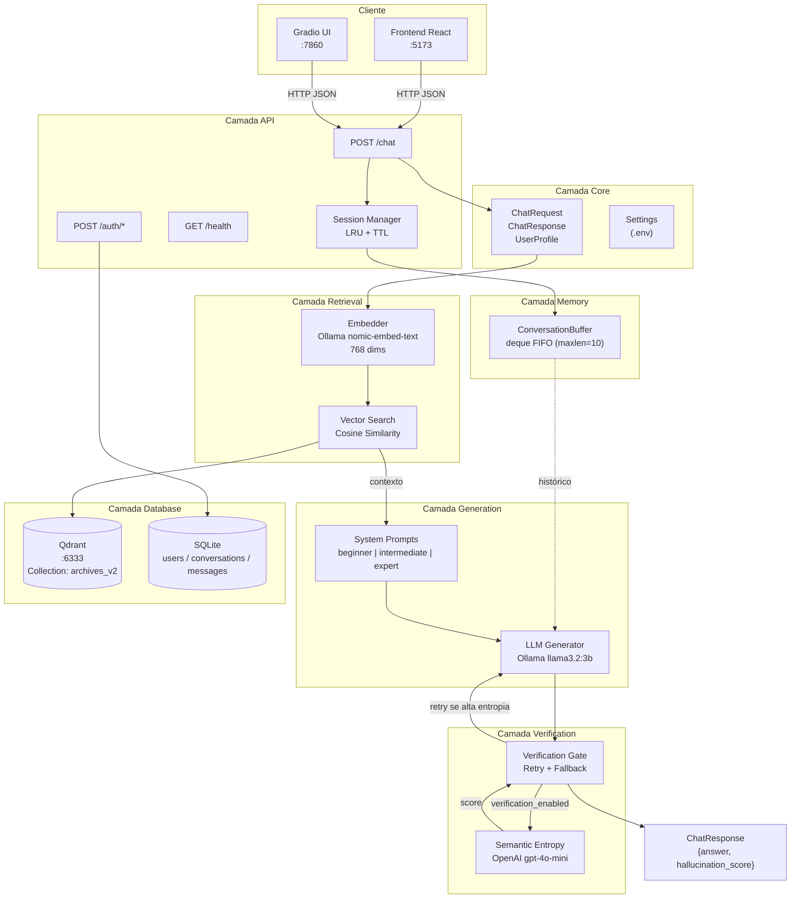
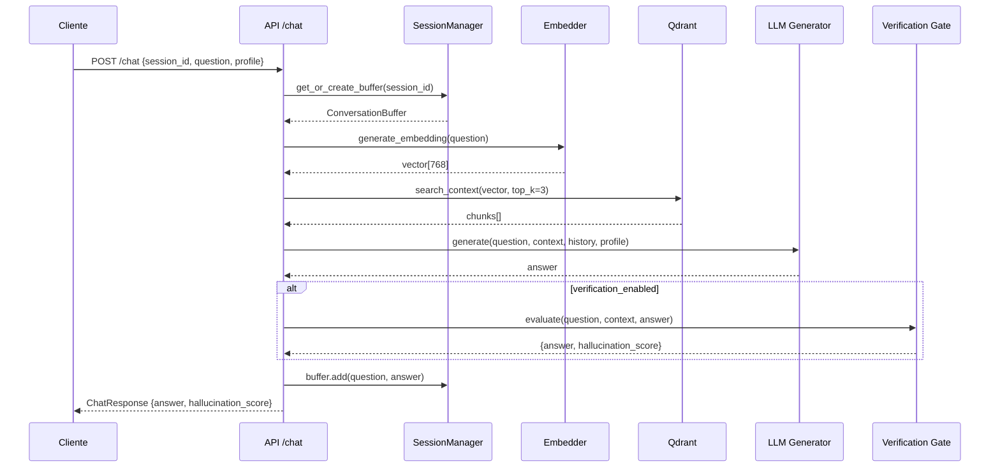
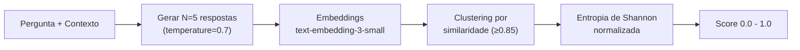
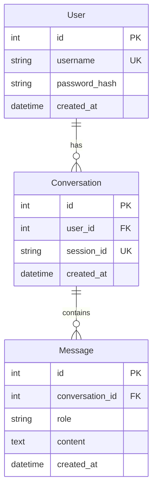
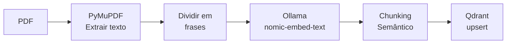

# ARCHITECTURE.md

Arquitetura do sistema SmartB100 — agente RAG para suporte técnico agrícola.

---

## Visão Geral

O SmartB100 é um sistema de perguntas e respostas especializado em agronomia, construído sobre a arquitetura RAG (Retrieval-Augmented Generation). O sistema recupera contexto relevante de documentos técnicos indexados e gera respostas adaptadas ao perfil do usuário.

A arquitetura é organizada em **oito camadas modulares**, cada uma com responsabilidade bem definida:

| Camada | Diretório | Responsabilidade |
|--------|-----------|------------------|
| API | `api/` | Endpoints REST, validação de contratos, gerenciamento de sessões |
| Core | `core/` | Schemas Pydantic, configurações globais via `.env` |
| Retrieval | `retrieval/` | Geração de embeddings e busca vetorial no Qdrant |
| Memory | `memory/` | Histórico conversacional por sessão (FIFO buffer) |
| Profiling | `profiling/` | Adaptação de respostas ao nível de expertise |
| Generation | `generation/` | Geração de respostas via Ollama com prompts adaptativos |
| Verification | `verification/` | Detecção de alucinações via entropia semântica |
| Database | `database/` | Persistência SQLite + Qdrant + indexação de PDFs |

---

## Diagrama de Arquitetura



---

## Pipeline RAG

O fluxo completo de uma requisição ao endpoint `/chat`:



---

## Camadas em Detalhe

### 1. Camada API (`api/`)

Ponto de entrada do sistema. Expõe endpoints REST via FastAPI com gerenciamento automático de sessões.

```
api/
├── main.py           # App FastAPI, CORS, lifespan hooks
└── routes/
    ├── chat.py       # POST /chat — pipeline RAG principal
    ├── auth.py       # POST /auth/register, /auth/token (JWT)
    └── health.py     # GET /health — status check
```

**Gerenciamento de Sessões:**

O endpoint `/chat` mantém um cache LRU de sessões em memória:

| Parâmetro | Valor | Descrição |
|-----------|-------|-----------|
| TTL | 1 hora | Sessões inativas são removidas |
| Max Size | 1000 | Limite de sessões simultâneas |
| Cleanup | Lazy | Até 10 sessões expiradas por requisição |

**Contrato do Endpoint Principal:**

```python
POST /chat
Request:
{
    "session_id": "uuid",           # Identifica a conversa
    "question": "Pergunta...",      # Texto do usuário
    "profile": {
        "name": "João",
        "expertise": "beginner"     # beginner | intermediate | expert
    }
}

Response:
{
    "answer": "Resposta...",
    "hallucination_score": 0.18     # 0.0 = confiável, 1.0 = possível alucinação
}
```

---

### 2. Camada Core (`core/`)

Define os contratos de dados e configurações do sistema.

```
core/
├── config.py         # Pydantic Settings (carrega .env)
└── schemas.py        # ChatRequest, ChatResponse, UserProfile, ExpertiseLevel
```

**Configurações Principais (`Settings`):**

| Variável | Default | Descrição |
|----------|---------|-----------|
| `CHAT_MODEL` | `llama3.2:3b` | Modelo Ollama para geração |
| `EMBED_MODEL` | `nomic-embed-text` | Modelo Ollama para embeddings |
| `QDRANT_URL` | `http://localhost:6333` | URL do Qdrant |
| `QDRANT_API_KEY` | `None` | API key para Qdrant Cloud |
| `COLLECTION_NAME` | `archives_v2` | Coleção de vetores |
| `TOP_K` | `3` | Chunks retornados por busca |
| `BUFFER_MAXLEN` | `10` | Turnos no histórico |
| `VERIFICATION_ENABLED` | `true` | Ativa verificação de alucinações |
| `HALLUCINATION_THRESHOLD` | `0.5` | Limiar para retry |
| `OPENAI_API_KEY` | - | Requerido para verificação |

**ExpertiseLevel:**

O nível de expertise determina o tom e complexidade das respostas:

| Nível | Comportamento |
|-------|---------------|
| `beginner` | Linguagem simples, exemplos práticos, evita termos técnicos |
| `intermediate` | Termos técnicos com explicações breves, assume conhecimento básico |
| `expert` | Precisão técnica, dados quantitativos, terminologia avançada |

---

### 3. Camada Retrieval (`retrieval/`)

Responsável por encontrar os trechos mais relevantes dos documentos indexados.

```
retrieval/
├── embedder.py       # Gera embeddings via Ollama
└── vector_store.py   # Busca no Qdrant
```

**Embedder (`embedder.py`):**

Converte texto em vetores de 768 dimensões usando o modelo `nomic-embed-text` via Ollama.

```python
embedding = generate_embedding("Qual o pH ideal para soja?")
# Retorna: list[float] com 768 elementos
```

**Vector Store (`vector_store.py`):**

Busca os `top_k` chunks mais similares no Qdrant usando similaridade de cosseno.

```python
chunks = search_context(embedding)
# Retorna: list[str] com até top_k textos
```

**Características:**
- Busca densa (ANN - Approximate Nearest Neighbors)
- Distância: COSINE
- Suporta autenticação via `QDRANT_API_KEY` para Qdrant Cloud

---

### 4. Camada Memory (`memory/`)

Mantém o histórico de conversas para contexto multi-turno.

```
memory/
└── conversation.py   # ConversationBuffer com deque FIFO
```

**ConversationBuffer:**

Buffer circular que descarta automaticamente turnos antigos quando atinge `maxlen`.

```python
buffer = ConversationBuffer(maxlen=10)

# Adiciona turnos
buffer.add("user", "Qual o pH ideal?")
buffer.add("assistant", "Entre 6.0 e 7.0...")

# Exporta para injetar no LLM
history = buffer.to_messages()
# [{"role": "user", "content": "..."}, {"role": "assistant", "content": "..."}]
```

**Implementação:**
- Usa `collections.deque` com `maxlen` para FIFO automático
- Cada sessão tem seu próprio buffer (isolamento via `session_id`)
- Buffers são armazenados no `SessionManager` da camada API

---

### 5. Camada Profiling (`profiling/`)

Adapta respostas ao perfil do usuário.

```
profiling/
├── profile.py        # Lógica de adaptação de expertise
└── intent_filter.py  # Classificação de domínio (agrícola vs outros)
```

**Adaptação por Expertise:**

O sistema seleciona system prompts diferentes baseado no `ExpertiseLevel`:

| Nível | System Prompt |
|-------|---------------|
| beginner | "Responda de forma clara e didática, usando linguagem simples..." |
| intermediate | "Responda de forma clara e objetiva, usando termos técnicos com explicações breves..." |
| expert | "Responda com precisão técnica e terminologia avançada..." |

---

### 6. Camada Generation (`generation/`)

Gera respostas usando LLM local via Ollama.

```
generation/
└── llm.py            # Função generate() com system prompts adaptativos
```

**Função `generate()`:**

```python
def generate(
    question: str,       # Pergunta atual
    context: str,        # Chunks do RAG concatenados
    history: list[dict], # Histórico da conversa
    profile: UserProfile # Perfil com expertise
) -> str:
```

**Construção de Messages:**

1. **System prompt** — Selecionado pelo `ExpertiseLevel`
2. **Histórico** — Turnos anteriores do buffer
3. **Pergunta atual** — Prefixada com contexto RAG

```python
messages = [
    {"role": "system", "content": "Você é um assistente..."},
    {"role": "user", "content": "Pergunta anterior"},
    {"role": "assistant", "content": "Resposta anterior"},
    {"role": "user", "content": "Contexto:\n{chunks}\n\nPergunta: {question}"}
]
```

---

### 7. Camada Verification (`verification/`)

Detecta alucinações usando entropia semântica.

```
verification/
├── entropy.py        # Cálculo de entropia semântica (OpenAI)
└── gate.py           # Orquestrador com retry logic
```

**Semantic Entropy (`entropy.py`):**

Baseado no paper "Semantic Uncertainty" (Farquhar et al., 2023).



**Interpretação do Score:**

| Score | Significado |
|-------|-------------|
| 0.0 - 0.3 | Baixa incerteza — respostas consistentes |
| 0.3 - 0.5 | Incerteza moderada — revisar contexto |
| 0.5 - 1.0 | Alta incerteza — possível alucinação |

**Verification Gate (`gate.py`):**

Orquestra o fluxo de verificação com retry automático:

1. Gera resposta com LLM local (Ollama)
2. Se `verification_enabled`, calcula entropia via OpenAI
3. Se entropia > threshold, regenera (até 2 tentativas)
4. Retorna resposta final com `hallucination_score`

**Requisitos:**
- `OPENAI_API_KEY` configurada no `.env`
- Sem API key, retorna `hallucination_score: 0.0` (bypass)

---

### 8. Camada Database (`database/`)

Persistência de dados estruturados e vetoriais.

```
database/
├── db.py                 # SQLAlchemy engine + session factory
├── models.py             # ORM: User, Conversation, Message
└── semantic_chunker.py   # CLI de indexação de PDFs
```

**Qdrant (Vetorial):**

| Propriedade | Valor |
|-------------|-------|
| Collection | `archives_v2` |
| Dimensão | 768 |
| Distância | COSINE |
| Payload | `{text: str, source: str, chunk_id: int}` |

**SQLite (Relacional):**



---

## Pipeline de Indexação

Processa PDFs e armazena chunks semânticos no Qdrant.



**Chunking Semântico:**

Agrupa frases consecutivas por similaridade de embeddings:

| Parâmetro | Valor | Descrição |
|-----------|-------|-----------|
| Threshold | 0.75 | Similaridade mínima para agrupar |
| Min frases | 3 | Mínimo de frases por chunk |
| Max frases | 20 | Máximo de frases por chunk |

**CLI:**

```bash
# Indexar todos os PDFs de um diretório
python database/semantic_chunker.py index ./archives/

# Testar busca
python database/semantic_chunker.py search "calagem do solo"
```

---

## Pipeline de Avaliação

Sistema automatizado para medir qualidade das respostas (`eval/`).

```mermaid
flowchart LR
    subgraph PREP["Preparação"]
        PDF["PDFs"] --> GEN["generate_questions.py"]
        GEN --> Q["questions.json"]
        Q --> COL["collect_references.py"]
        COL --> REF["reference_answers.json"]
    end

    subgraph EXEC["Execução"]
        REF --> RUN["run_evaluation.py"]
        RUN --> API["POST /chat"]
        API --> RES["evaluation_results.json"]
        RES --> JUDGE["judge.py"]
        JUDGE --> JUD["judged_results.json"]
        JUD --> REP["report.py"]
        REP --> MD["report.md"]
    end
```



**Componentes:**

| Script | Função | Providers |
|--------|--------|-----------|
| `generate_questions.py` | Gera perguntas de PDFs | Groq, Ollama, OpenRouter |
| `collect_references.py` | Coleta respostas de referência | Groq, Ollama, OpenRouter |
| `run_evaluation.py` | Executa contra a API | HTTP local |
| `judge.py` | LLM-as-judge scoring | Groq, Ollama, OpenRouter |
| `report.py` | Gera relatório final | Local |

---

## Stack Tecnológica

### Backend

| Componente | Tecnologia | Versão |
|------------|------------|--------|
| Framework | FastAPI | 0.111+ |
| LLM | Ollama | llama3.2:3b |
| Embeddings | Ollama | nomic-embed-text (768d) |
| Vector DB | Qdrant | 1.9+ |
| SQL DB | SQLite + SQLAlchemy | 2.0+ |
| Auth | PyJWT + bcrypt | - |
| Verification | OpenAI API | gpt-4o-mini |

### Frontend

| Componente | Tecnologia |
|------------|------------|
| Framework | React 18+ |
| Build | Vite |
| Alt UI | Gradio 4+ |

### Infraestrutura

| Serviço | Porta | Descrição |
|---------|-------|-----------|
| FastAPI | 8000 | Backend API |
| React/Vite | 5173 | Frontend dev |
| Gradio | 7860 | UI alternativa |
| Qdrant | 6333 | Vector database |
| Ollama | 11434 | LLM inference |

---

## Configuração

Variáveis de ambiente (`.env`):

```bash
# Modelos Ollama
CHAT_MODEL=llama3.2:3b
EMBED_MODEL=nomic-embed-text

# Qdrant
QDRANT_URL=http://localhost:6333
QDRANT_API_KEY=                    # Opcional (Qdrant Cloud)
COLLECTION_NAME=archives_v2
TOP_K=3

# Conversação
BUFFER_MAXLEN=10

# Verificação de Alucinações
VERIFICATION_ENABLED=true
HALLUCINATION_THRESHOLD=0.5
OPENAI_API_KEY=                    # Requerido para verificação

# Autenticação
JWT_SECRET_KEY=your-secret-key

# APIs externas (pipeline de avaliação)
GROQ_API_KEY=
OPENROUTER_API_KEY=
```

---

## Roadmap

Itens planejados para versões futuras:

| Feature | Descrição | Status |
|---------|-----------|--------|
| Hybrid Search | Dense + Sparse (BM25) com RRF Fusion | Planejado |
| LangGraph | Migração para grafo ReAct | Planejado |
| Claim Verification | Decomposição atômica + fact-check | Planejado |
| Streaming | SSE para respostas incrementais | Planejado |
| GraphRAG | Grafo de conhecimento agrícola | Futuro |
