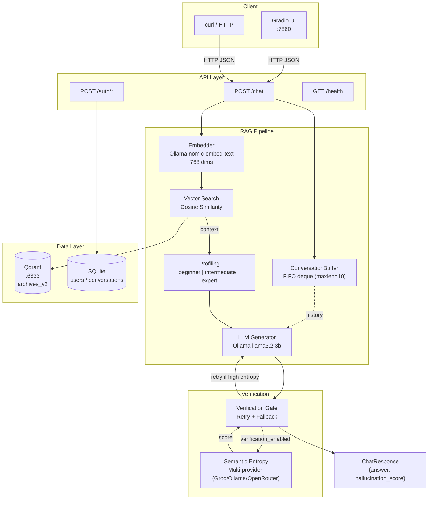
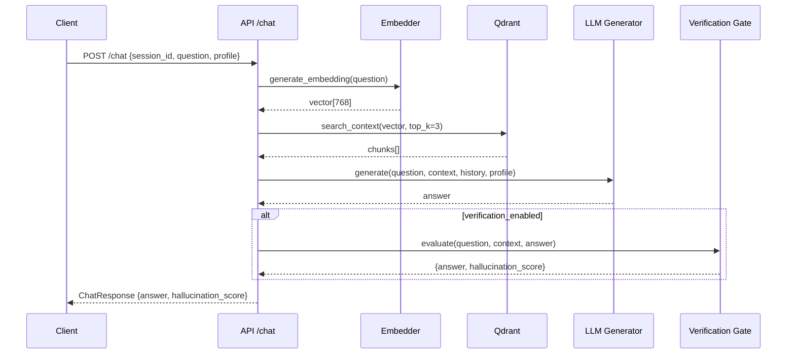

# SmartB100 — Agriculture RAG Agent

> RAG-powered chat system for agricultural technical support, with hallucination verification through semantic entropy.

## Why This Exists

Agricultural extension workers and agronomists need quick, reliable answers to technical questions about crop management, soil treatment, pest control, and planting schedules. Traditional search through dense PDF manuals is slow and error-prone.

SmartB100 indexes agricultural PDF documents into a vector database and uses a local LLM to generate answers grounded in the indexed content. The system adapts response complexity to the user's expertise level (beginner, intermediate, expert) and flags potentially hallucinated answers using semantic entropy scoring, so users know when to double-check the information.

## Architecture



**RAG Pipeline Flow:**



## Engineering Decisions

| Decision | Rationale |
|----------|-----------|
| **Ollama for all embeddings** | Even when generation uses Groq or OpenRouter, embeddings for entropy clustering use Ollama (`nomic-embed-text`) locally. Free, fast, no external API dependency for embeddings. |
| **Semantic entropy over binary classifiers** | Generates N candidate responses, clusters by semantic similarity, computes Shannon entropy. Higher entropy = less agreement between candidates = higher hallucination risk. Produces a continuous score (0.0-1.0) instead of a binary flag. |
| **Multi-provider verification** | Replaced OpenAI-only verification with Groq/Ollama/OpenRouter dispatch. Removes hard dependency on paid API for hallucination checks. |
| **Ollama embeddings with retries + backoff** | Centralized in `retrieval/ollama_embeddings.py`: truncation at 8192 chars, 6 attempts, exponential backoff up to 60s. Handles `ResponseError`, `ConnectionError`, `httpx` errors, and `OSError`. Used by chunker, embedder, and entropy verification. |
| **SQLite with pathlib + POSIX URLs** | `database/db.py` uses `Path.as_posix()` for SQLite connection strings. On Windows with Docker bind mounts, the host may create `smartb100_v2.db` as a directory instead of a file; the API raises `RuntimeError` with a clear message if this happens. |
| **Sync endpoint for /chat** | `def chat()` instead of `async def chat()`. FastAPI runs sync handlers in a thread pool, which frees the event loop for `/health` and other concurrent requests while the LLM blocks. |
| **mypy `ignore_missing_imports=true`** | Ollama, qdrant-client, and other dependencies lack type stubs. Avoids false positives without compromising type checking on project code. |
| **Profile-aware system prompts** | Three expertise levels (`beginner`, `intermediate`, `expert`) select different system prompts. Same RAG context, different response complexity. No separate models or fine-tuning needed. |
| **bcrypt + JWT gate on `/chat`** | Passwords hashed with bcrypt (timing-safe verify via passlib); `/chat` requires `Authorization: Bearer <JWT>`. Rate-limit via slowapi: 5 logins / 15 min and 3 registrations / hour per IP. `JWT_SECRET_KEY` must be ≥32 chars (validated at startup). **Breaking:** users created before this gate (SHA-256) must be re-registered. |

## How to Run

### Prerequisites

- **Docker Desktop** ([download](https://www.docker.com/products/docker-desktop/))
- **Ollama** ([download](https://ollama.ai/download))
- **Python 3.12+** ([download](https://www.python.org/downloads/))

### Setup

```bash
# 1. Pull models
ollama pull llama3.2:3b && ollama pull nomic-embed-text

# 2. Install dependencies
uv sync                            # or: python -m venv .venv && .venv/bin/pip install -e .

# 3. Configure environment
cp .env.example .env               # defaults work for local dev

# 4. Start Qdrant
docker compose --profile infra up -d

# 5. Index documents (first run only)
.venv/bin/python database/semantic_chunker.py index ./archives/

# 6. Start API
.venv/bin/python -m uvicorn api.main:app --reload

# 7. (Optional) Start Gradio UI
.venv/bin/python ui/chat_ui.py
```

Windows users: replace `.venv/bin/python` with `.venv\Scripts\python.exe`, or use `.\start.bat` / `.\start.ps1` after steps 1-3.

Full Docker deployment: `docker compose --profile infra --profile app up -d`

See [`SETUP.md`](./SETUP.md) for remote Qdrant configuration.

### Verify

```bash
curl http://localhost:6333/healthz           # Qdrant: "healthz check passed"
curl http://localhost:8000/health            # API: {"status":"ok"}
```

## API Reference

| Endpoint | Description |
|----------|-------------|
| `POST /chat` | RAG query (requires JWT); returns answer with hallucination score |
| `POST /auth/register` | Creates new user (rate-limit 3/hour per IP) |
| `POST /auth/token` | OAuth2 login; returns JWT (rate-limit 5 / 15min per IP) |
| `GET /health` | API health status |

**POST /chat:**

```bash
TOKEN=$(curl -s -X POST "http://localhost:8000/auth/token" \
  -d "username=demo&password=long-enough-pw" | jq -r .access_token)

curl -X POST "http://localhost:8000/chat" \
  -H "Authorization: Bearer $TOKEN" \
  -H "Content-Type: application/json" \
  -d '{
    "session_id": "demo-session",
    "question": "Qual a epoca ideal de plantio da soja?",
    "profile": {"name": "User", "expertise": "beginner"}
  }'
# {"answer": "...", "hallucination_score": 0.18}
```

Without the `Authorization` header the API returns `401 Unauthorized`.

| Request Field | Type | Description |
|---------------|------|-------------|
| `session_id` | string | UUID for conversation continuity |
| `question` | string | User query |
| `profile.expertise` | enum | `beginner` \| `intermediate` \| `expert` |

| Response Field | Type | Description |
|----------------|------|-------------|
| `answer` | string | Generated response adapted to expertise level |
| `hallucination_score` | float | 0.0 (grounded) to 1.0 (likely hallucinated) |

## Project Structure

```
sb100_agents/
├── api/                            # FastAPI backend
│   ├── main.py                     # App entry (CORS + routers + lifespan)
│   └── routes/                     # chat.py, auth.py, health.py
├── core/                           # Pydantic schemas & configuration
├── retrieval/                      # Embeddings + Qdrant vector search
├── generation/                     # LLM response generation
├── memory/                         # Conversation buffer (FIFO)
├── profiling/                      # User expertise adaptation
├── verification/                   # Semantic entropy + verification gate
├── database/                       # SQLite + PDF semantic chunking
├── eval/                           # 5-step evaluation pipeline
├── ui/                             # Gradio chat interface
├── tests/                          # Unit + integration tests
├── .claude/                        # Agent workflow enforcement
│   ├── rules/                      # Directive files (00-12)
│   ├── guia-configuracao-codex.md  # Codex plugin setup guide
│   ├── registry.md                 # Project state & history
│   ├── tasks.md                    # Task registry
│   └── hooks/                      # Git hooks (commit-msg, pre-commit, etc.)
├── .github/workflows/              # CI + Claude Code automation
├── docker-compose.yml              # Qdrant (infra) + API+Gradio (app)
└── pyproject.toml
```

## Roadmap

| Feature | Description |
|---------|-------------|
| Hybrid search | Dense + sparse vectors with RRF fusion |
| LangGraph migration | ReAct agent with agricultural intent filter |
| Claim Verification | Atomic decomposition + RAG-based fact checking |
| Streaming | SSE for incremental responses |

## Automated Issue Implementation

Issues labeled `claude-auto` are automatically implemented by Claude Code via GitHub Actions. Mention `@claude` in any issue or PR comment for interactive assistance.

Setup: add `ANTHROPIC_API_KEY` secret and create the `claude-auto` label.

## Contributing

See [`CONTRIBUTING.md`](./CONTRIBUTING.md). Quick summary: fork, branch (`type/TASK-NNN-description`), tests, Conventional Commits, PR.

## License

[MIT License](./LICENSE)
