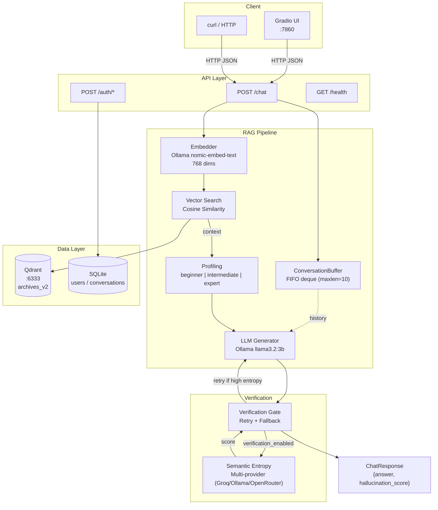
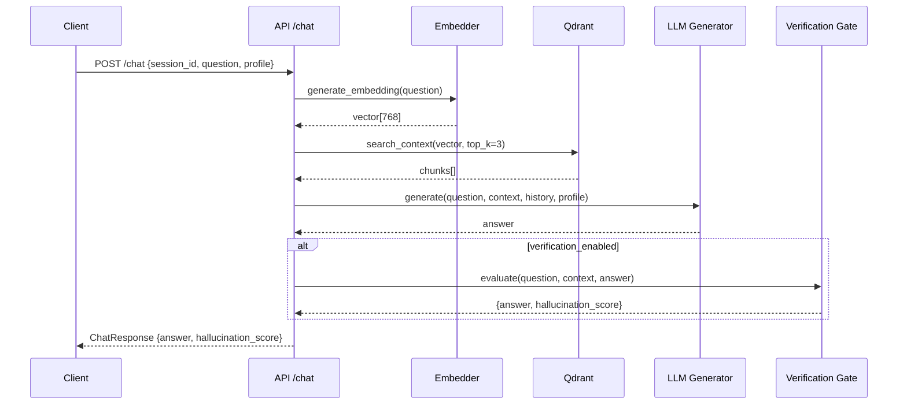
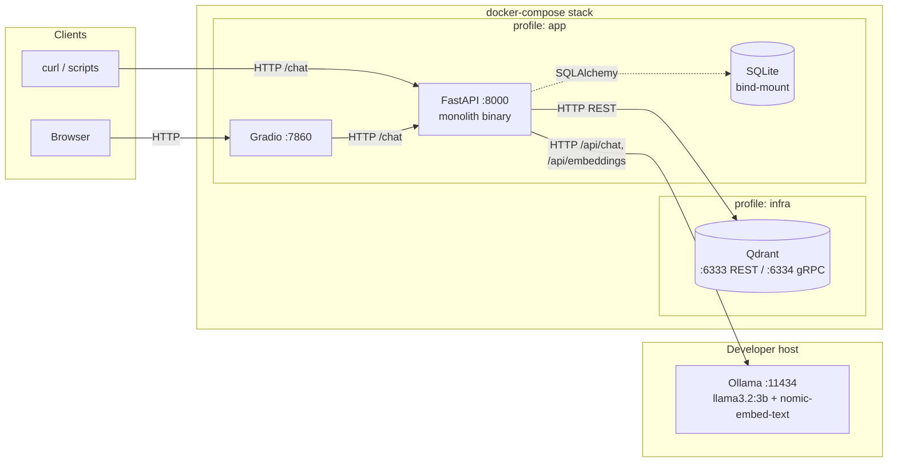

# SmartB100 — Agriculture RAG Agent

> Self-hostable RAG assistant for agricultural technical support: it answers questions grounded in your own PDF manuals, adapts the response to the reader's expertise, and tags every answer with a continuous **0.0–1.0 semantic-entropy hallucination score** so users know when to double-check.

---

## What It Does

SmartB100 turns a folder of agricultural PDFs into a question-answering service backed by a local LLM, grounding every answer in retrieved content.

- **Grounded Q&A** — indexes PDF manuals into a vector database and answers questions from the retrieved chunks, not from model memory.
- **Expertise-adaptive answers** — the same RAG context is rendered for `beginner`, `intermediate`, or `expert` readers via profile-aware system prompts.
- **Hallucination scoring** — semantic entropy over multiple candidate answers produces a continuous `0.0–1.0` score flagging low-confidence responses.
- **Authenticated API** — bcrypt password hashing + JWT-gated `/chat`, with per-IP rate limiting on login and registration.
- **Runs fully local** — Ollama serves both chat and embeddings; no paid API key is required to operate the core pipeline.

## What It Is

SmartB100 is a **REST API** (FastAPI) with an optional **Gradio web UI** that converts a corpus of agricultural PDFs into a source-grounded chat service. It targets agricultural extension workers and agronomists who need fast, reliable answers about crop management, soil treatment, pest control, and planting schedules — without manually searching dense technical manuals.

## Tech Stack

| Layer | Technology |
| --- | --- |
| Language | Python 3.12+ |
| API / Runtime | FastAPI, Uvicorn |
| UI | Gradio |
| Vector DB | Qdrant (`archives_v2`, 768-dim embeddings) |
| Inference | Ollama — `llama3.2:3b` (chat) + `nomic-embed-text` (embeddings) |
| Verification | Multi-provider semantic entropy (Groq / Ollama / OpenRouter) |
| Persistence | SQLite (auth + conversation history) |
| Auth | bcrypt + JWT (passlib, slowapi rate limiting) |
| Testing / CI | pytest, ruff, mypy `--strict`, GitHub Actions |
| Packaging | uv, Docker (multi-stage `Dockerfile.api`) |

## Architecture

### Architectural Style

SmartB100 is a **modular monolith with composed deployment**:

- **One application process.** `api/main.py` loads every domain module (`api/routes/*`, `core/*`, `retrieval/*`, `memory/*`, `generation/*`, `verification/*`, `database/*`) into a single FastAPI runtime. Inter-module communication is **function calls inside the same Python interpreter** — no RPC, no message broker, no queue.
- **Eight internal layers, one binary.** The folder boundary is a convention for testability and review; it is **not** a network boundary.
- **External processes are limited to genuine third-party services.** No domain code lives outside the API process.

External components (each runs in its own process):

| Component | Role | Containerized? | Protocol |
|-----------|------|----------------|----------|
| **Qdrant** | Vector DB (`archives_v2` collection, 768-dim embeddings) | Yes — `docker compose --profile infra` | HTTP REST `:6333` + gRPC `:6334` |
| **Ollama** | LLM chat (`llama3.2:3b`) + embeddings (`nomic-embed-text`) | **No** — runs on the host | HTTP REST `:11434` via `OLLAMA_HOST` |
| **SQLite** | Auth + conversation history | No (filesystem) | Bind-mount `./smartb100_v2.db:/app/smartb100_v2.db` |

Client tier (two paths):

- **Gradio UI** (`ui/chat_ui.py`) — stateless HTTP client containerized via `docker compose --profile app`. Calls only `POST /chat`. Does **not** import any domain module — it is a UI shell, not a microservice.
- **Direct HTTP** — `curl`, scripts, future mobile clients. Same endpoint, same JSON contract.

**Why not microservices.** The RAG pipeline (embed → search → generate → verify) shares the same `ChatRequest`/`ChatResponse` model and runs synchronously within a single request. Splitting any step into its own service would add network latency between calls that are currently in-process, plus contract-versioning overhead, without delivering independent scaling benefit at current load.

**When to reconsider.** If `verification/` (entropy sampling, the slowest step) needs to scale independently of `generation/`, or if the workload grows beyond ~500 req/s, the verification gate is the natural extraction point — it already has a clean async-friendly interface (`evaluate(question, context, answer)`).


```mermaid
flowchart TD
    subgraph CLIENT["Client"]
        GRADIO["Gradio UI\n:7860"]
        CURL["curl / HTTP"]
    end

    subgraph API["API Layer"]
        ENDPOINT["POST /chat"]
        AUTH["POST /auth/*"]
        HEALTH["GET /health"]
    end

    subgraph PIPELINE["RAG Pipeline"]
        EMBED["Embedder\nOllama nomic-embed-text\n768 dims"]
        SEARCH["Vector Search\nCosine Similarity"]
        MEMORY["ConversationBuffer\nFIFO deque (maxlen=10)"]
        PROFILE["Profiling\nbeginner | intermediate | expert"]
        LLM["LLM Generator\nOllama llama3.2:3b"]
    end

    subgraph VERIFY["Verification"]
        ENTROPY["Semantic Entropy\nMulti-provider (Groq/Ollama/OpenRouter)"]
        GATE["Verification Gate\nRetry + Fallback"]
    end

    subgraph DATA["Data Layer"]
        QDRANT[("Qdrant\n:6333\narchives_v2")]
        SQLITE[("SQLite\nusers / conversations")]
    end

    GRADIO -->|HTTP JSON| ENDPOINT
    CURL -->|HTTP JSON| ENDPOINT

    ENDPOINT --> EMBED
    EMBED --> SEARCH
    SEARCH --> QDRANT

    ENDPOINT --> MEMORY
    MEMORY -.->|history| LLM
    SEARCH -->|context| PROFILE
    PROFILE --> LLM

    LLM --> GATE
    GATE -->|verification_enabled| ENTROPY
    ENTROPY -->|score| GATE
    GATE -->|retry if high entropy| LLM

    GATE --> RESPONSE["ChatResponse\n{answer, hallucination_score}"]

    AUTH --> SQLITE
```

**RAG Pipeline Flow:**


```mermaid
sequenceDiagram
    participant C as Client
    participant A as API /chat
    participant E as Embedder
    participant Q as Qdrant
    participant G as LLM Generator
    participant V as Verification Gate

    C->>A: POST /chat {session_id, question, profile}
    A->>E: generate_embedding(question)
    E-->>A: vector[768]
    A->>Q: search_context(vector, top_k=3)
    Q-->>A: chunks[]
    A->>G: generate(question, context, history, profile)
    G-->>A: answer
    alt verification_enabled
        A->>V: evaluate(question, context, answer)
        V-->>A: {answer, hallucination_score}
    end
    A-->>C: ChatResponse {answer, hallucination_score}
```

**Deployment Topology:**


```mermaid
flowchart LR
    subgraph CLIENTS["Clients"]
        direction TB
        BROWSER["Browser"]
        SCRIPTS["curl / scripts"]
    end

    subgraph HOST["Developer host"]
        OLLAMA["Ollama :11434<br/>llama3.2:3b + nomic-embed-text"]
    end

    subgraph COMPOSE["docker-compose stack"]
        direction TB
        subgraph INFRA["profile: infra"]
            QDRANT[("Qdrant<br/>:6333 REST / :6334 gRPC")]
        end
        subgraph APP["profile: app"]
            API["FastAPI :8000<br/>monolith binary"]
            GRADIO["Gradio :7860"]
            SQLITE[("SQLite<br/>bind-mount")]
        end
    end

    BROWSER -->|HTTP| GRADIO
    SCRIPTS -->|HTTP /chat| API
    GRADIO -->|HTTP /chat| API
    API -->|HTTP REST| QDRANT
    API -->|HTTP /api/chat,<br/>/api/embeddings| OLLAMA
    API -. SQLAlchemy .-> SQLITE
```

The first two diagrams are *logical* (what runs); the last is *topological* (where it runs). They complement, not duplicate.

## Engineering Decisions

| Decision | Alternative considered | Why this approach |
| --- | --- | --- |
| **Modular monolith** | Microservice per RAG step | The pipeline steps share one `ChatRequest`/`ChatResponse` model and run synchronously per request; splitting them would add network latency and contract-versioning overhead with no scaling benefit at current load. See [§ Architectural Style](#architectural-style). |
| **Semantic entropy for hallucination scoring** | Binary classifier / LLM-as-judge flag | Clustering N candidate answers by similarity and computing Shannon entropy yields a continuous `0.0–1.0` score with no labeled training data — disagreement between candidates *is* the signal. |
| **Ollama for all embeddings** | Hosted provider embeddings (Groq / OpenRouter) | Keeps the embedding space stable regardless of the generation provider, runs free and offline, and removes a paid API dependency from the verification path. |
| **Multi-provider verification dispatch** | OpenAI-only verification | Removes the hard dependency on a paid API; the Ollama provider keeps the entire hallucination check runnable offline. |
| **Sync `/chat` handler** | `async def chat()` | FastAPI runs sync handlers in a thread pool, freeing the event loop for `/health` and concurrent requests while the LLM blocks — an `async` handler would block the loop on the synchronous Ollama call. |
| **bcrypt + JWT gate on `/chat`** | Session cookies / static API keys | Stateless, timing-safe auth that fits a stateless API; the accepted cost is one DB lookup per request in exchange for instant revocation when a user is deleted. **Breaking:** pre-gate SHA-256 users must re-register. |
| **SQLite for persistence** | PostgreSQL | Zero-ops single-node storage matches current scale; the Windows bind-mount pitfall is documented and the API fails loudly (`RuntimeError`) instead of silently. Postgres is the migration path once writes contend. |
| **Local `llama3.2:3b` on CPU** | Larger hosted model | Keeps the system fully offline and free to run; the accepted trade-off is higher latency, mitigated by a configurable `CHAT_TIMEOUT` and transient-error retries. |

## Getting Started

### Prerequisites

- **Python 3.12+** ([download](https://www.python.org/downloads/))
- **Docker Desktop** ([download](https://www.docker.com/products/docker-desktop/)) — for Qdrant
- **Ollama** ([download](https://ollama.ai/download)) — for local inference

### Installation

```bash
git clone https://github.com/LukeSantossz/sb100_agents.git
cd sb100_agents

# Pull inference models
ollama pull llama3.2:3b && ollama pull nomic-embed-text

# Install dependencies
uv sync                            # or: python -m venv .venv && .venv/bin/pip install -e .

# Configure environment (defaults work for local dev)
cp .env.example .env
```

### Running

```bash
# 1. Start Qdrant
docker compose --profile infra up -d

# 2. Index documents (first run only)
.venv/bin/python database/semantic_chunker.py index ./archives/

# 3. Start API
.venv/bin/python -m uvicorn api.main:app --reload

# 4. (Optional) Start Gradio UI
.venv/bin/python ui/chat_ui.py
```

Windows users: replace `.venv/bin/python` with `.venv\Scripts\python.exe`, or run `.\start.bat` / `.\start.ps1` after installation.

Full Docker deployment: `docker compose --profile infra --profile app up -d`. The compose stack uses a **multi-stage `Dockerfile.api`** (no `build-essential` in the final image), **healthchecks** that gate `depends_on` ordering, and **log rotation** (`max-size: 10m`, `max-file: 3`). On **Linux** the `OLLAMA_HOST` override is required — see [`SETUP.md` §9.1](./SETUP.md#91-deploy-em-linux-nativo). See [`SETUP.md`](./SETUP.md) for remote Qdrant configuration.

Verify the stack is up:

```bash
curl http://localhost:6333/healthz           # Qdrant: "healthz check passed"
curl http://localhost:8000/health            # API: {"status":"ok"}
```

### Tests

```bash
pytest tests/ -v --ignore=tests/test_integration.py   # unit suite (CI default)
ruff check .                                           # lint
mypy retrieval/ generation/ memory/ --strict          # type check
```

## API Reference

| Endpoint | Description |
|----------|-------------|
| `POST /chat` | RAG query (requires JWT); returns answer with hallucination score |
| `POST /auth/register` | Creates new user (rate-limit 3/hour per IP) |
| `POST /auth/token` | OAuth2 login; returns JWT (rate-limit 5 / 15min per IP) |
| `GET /health` | API health status |

**POST /chat:**

```bash
TOKEN=$(curl -s -X POST "http://localhost:8000/auth/token" \
  -d "username=demo&password=long-enough-pw" | jq -r .access_token)

curl -X POST "http://localhost:8000/chat" \
  -H "Authorization: Bearer $TOKEN" \
  -H "Content-Type: application/json" \
  -d '{
    "session_id": "demo-session",
    "question": "Qual a epoca ideal de plantio da soja?",
    "profile": {"name": "User", "expertise": "beginner"}
  }'
# {"answer": "...", "hallucination_score": 0.18}
```

Without the `Authorization` header the API returns `401 Unauthorized`.

| Request Field | Type | Description |
|---------------|------|-------------|
| `session_id` | string | UUID for conversation continuity |
| `question` | string | User query |
| `profile.expertise` | enum | `beginner` \| `intermediate` \| `expert` |

| Response Field | Type | Description |
|----------------|------|-------------|
| `answer` | string | Generated response adapted to expertise level |
| `hallucination_score` | float | 0.0 (grounded) to 1.0 (likely hallucinated) |

## Project Structure

```
sb100_agents/
├── api/                            # FastAPI backend
│   ├── main.py                     # App entry (CORS + routers + lifespan)
│   └── routes/                     # chat.py, auth.py, health.py
├── core/                           # Pydantic schemas & configuration
├── retrieval/                      # Embeddings + Qdrant vector search
├── generation/                     # LLM response generation
├── memory/                         # Conversation buffer (FIFO)
├── verification/                   # Semantic entropy + verification gate
├── database/                       # SQLite + PDF semantic chunking
├── eval/                           # 5-step evaluation pipeline
├── ui/                             # Gradio chat interface
├── tests/                          # Unit + integration tests
├── .github/workflows/              # CI + Claude Code automation
├── Dockerfile.api                  # Multi-stage build (builder + runtime)
├── docker-compose.yml              # Qdrant (infra) + API+Gradio (app) with healthchecks
└── pyproject.toml
```

## Project Status

**Status: MVP complete — actively hardened.**

### Done

- [x] PDF indexing pipeline (semantic chunking → Qdrant)
- [x] RAG chat with expertise-adaptive responses
- [x] Semantic-entropy hallucination scoring (multi-provider)
- [x] bcrypt + JWT auth with per-IP rate limiting
- [x] Dockerized deployment (infra + app profiles, healthchecks, log rotation)
- [x] 5-step offline evaluation pipeline (`eval/`)
- [x] Test suite (205 tests, ~83% coverage) with CI: ruff + mypy `--strict` + pytest

### Pending

- [ ] Raise critical-module coverage to a 70% CI gate
- [ ] Optional Langfuse tracing for the RAG pipeline
- [ ] Hybrid search (dense + sparse vectors, RRF fusion)
- [ ] LangGraph migration (ReAct agent + agricultural intent filter)
- [ ] Claim verification (atomic decomposition + RAG fact-checking)
- [ ] Streaming responses (SSE)

## Known Issues & Limitations

- **CPU inference latency** — `llama3.2:3b` with RAG context can take minutes per answer on CPU-only hosts. A configurable `CHAT_TIMEOUT` (default 600s) plus transient-error retries exist for this reason; the limitation disappears with a GPU or a hosted provider.
- **Single-node persistence** — SQLite is single-writer. It fits one API process but does not support horizontal scaling; PostgreSQL is the migration path once writes contend.
- **Windows + Docker bind mount** — if `./smartb100_v2.db` does not already exist as a file, Docker Desktop may create it as a *directory*. Create the empty file before `docker compose --profile app up`; the API raises an explicit `RuntimeError` if it finds a directory.
- **Coverage gate is conservative** — the CI coverage threshold is currently below the 70% target on critical modules. Raising it is in progress (see Project Status).
- **Breaking auth change** — users created before the bcrypt + JWT gate (SHA-256 hashes) must be re-registered.
- **Verification adds latency** — entropy sampling generates multiple candidate answers. It is opt-in via `VERIFICATION_ENABLED` and falls back to a neutral score on failure rather than blocking the answer.

## Contributing

See [`CONTRIBUTING.md`](./CONTRIBUTING.md). Quick summary: fork, branch (`type/short-description`), tests, Conventional Commits, PR.

## License

[MIT License](./LICENSE)
