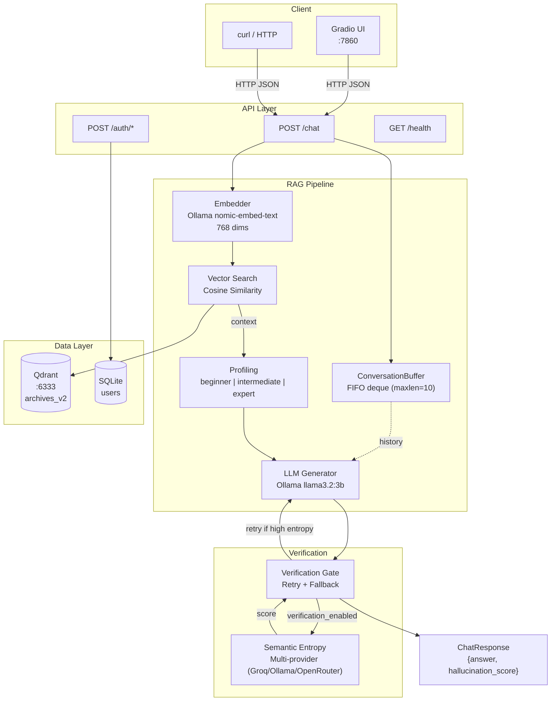
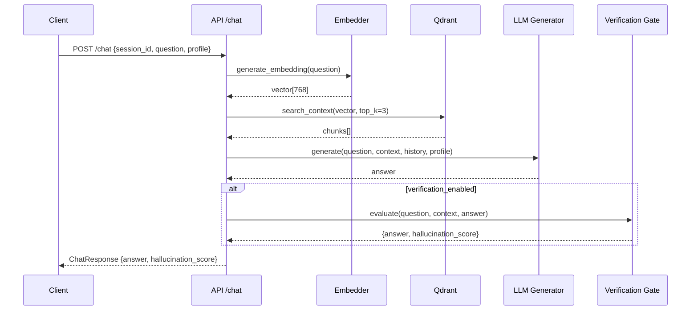
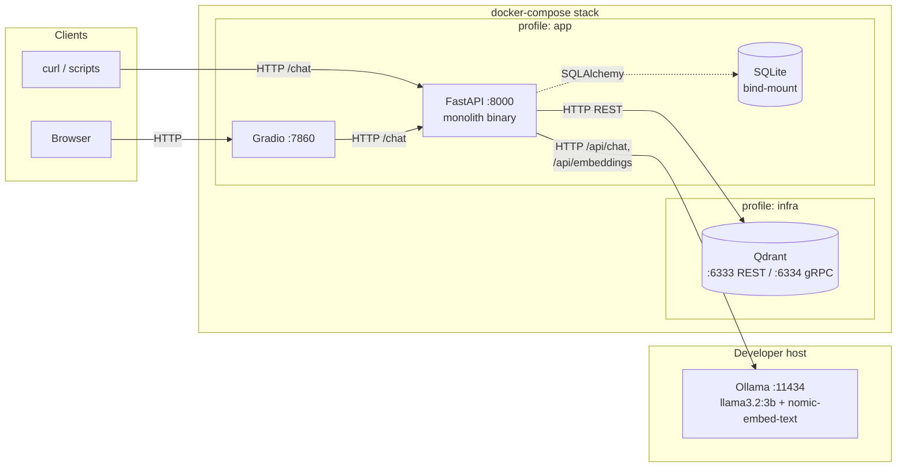

# SmartB100 — Agriculture RAG Agent

> Self-hostable RAG assistant for agricultural technical support: it answers questions grounded in your own PDF manuals, adapts the response to the reader's expertise, and — when a verification provider is reachable — tags every answer with a continuous **0.0–1.0 semantic-entropy hallucination score** so users know when to double-check.

---

## What It Does

SmartB100 turns a folder of agricultural PDFs into a question-answering service backed by a local LLM, grounding every answer in retrieved content.

- **Grounded Q&A** — indexes PDF manuals into a vector database and answers questions from the retrieved chunks, not from model memory.
- **Expertise-adaptive answers** — the same RAG context is rendered for `beginner`, `intermediate`, or `expert` readers via profile-aware system prompts.
- **Hallucination scoring** — semantic entropy over multiple candidate answers produces a continuous `0.0–1.0` score flagging low-confidence responses. It is on by default and degrades to a neutral `0.5` when the configured verification provider is unreachable.
- **Authenticated API** — bcrypt password hashing + JWT-gated `/chat`, with per-IP rate limiting on login and registration and a per-user limit on `/chat`.
- **Runs local for chat and retrieval** — Ollama serves both chat and embeddings, so the RAG pipeline needs no paid API key. Verification defaults to the hosted Groq provider; set `VERIFICATION_PROVIDER=ollama` for a fully local run. Under Docker that variable must also be added to the `api` service's `environment` list in `docker-compose.yml`, which does not currently forward it.

## What It Is

SmartB100 is a **REST API** (FastAPI) with an optional **Gradio web UI** that converts a corpus of agricultural PDFs into a source-grounded chat service. It targets agricultural extension workers and agronomists who need fast, reliable answers about crop management, soil treatment, pest control, and planting schedules — without manually searching dense technical manuals.

## Tech Stack

| Layer | Technology |
| --- | --- |
| Language | Python 3.12+ |
| API / Runtime | FastAPI, Uvicorn |
| UI | Gradio |
| Vector DB | Qdrant (`archives_v2`, 768-dim embeddings) |
| Inference | Ollama — `llama3.2:3b` (chat) + `nomic-embed-text` (embeddings) |
| Verification | Multi-provider semantic entropy (Groq / Ollama / OpenRouter) |
| Persistence | SQLite (user accounts) |
| Auth | bcrypt + JWT (passlib, slowapi rate limiting) |
| Testing / CI | pytest, ruff, mypy `--strict`, GitHub Actions |
| Packaging | uv, Docker (multi-stage `Dockerfile.api`) |

## Architecture

### Architectural Style

SmartB100 is a **modular monolith with composed deployment**:

- **One application process.** `api/main.py` loads every domain module (`api/routes/*`, `agent/*`, `core/*`, `retrieval/*`, `memory/*`, `generation/*`, `verification/*`, `database/*`) into a single FastAPI runtime. Inter-module communication is **function calls inside the same Python interpreter** — no RPC, no message broker, no queue.
- **Eight internal layers, one binary.** The folder boundary is a convention for testability and review; it is **not** a network boundary.
- **External processes are limited to genuine third-party services.** No domain code lives outside the API process.

External components (each runs in its own process):

| Component | Role | Containerized? | Protocol |
|-----------|------|----------------|----------|
| **Qdrant** | Vector DB (`archives_v2` collection, 768-dim embeddings) | Yes — `docker compose --profile infra` | HTTP REST `:6333` + gRPC `:6334` |
| **Ollama** | LLM chat (`llama3.2:3b`) + embeddings (`nomic-embed-text`) | **No** — runs on the host | HTTP REST `:11434` via `OLLAMA_HOST` |
| **SQLite** | User accounts | No (filesystem) | Bind-mount `./smartb100_v2.db:/app/smartb100_v2.db` |

Client tier (two paths):

- **Gradio UI** (`ui/chat_ui.py`) — stateless HTTP client containerized via `docker compose --profile app`. Calls `POST /auth/token` to log in and `POST /chat` to ask. Imports only `core.config` for shared client settings; it holds no pipeline logic (no `retrieval/`, `generation/`, `verification/`, or `agent/`) and reaches the API over HTTP — a UI shell, not a microservice.
- **Direct HTTP** — `curl`, scripts, future mobile clients. Same endpoint, same JSON contract.

**Why not microservices.** The RAG pipeline (embed → search → generate → verify) shares the same `ChatRequest`/`ChatResponse` model and runs synchronously within a single request. Splitting any step into its own service would add network latency between calls that are currently in-process, plus contract-versioning overhead, without delivering independent scaling benefit at current load.

**When to reconsider.** If `verification/` (entropy sampling, the slowest step) needs to scale independently of `generation/`, or if the workload grows beyond ~500 req/s, the verification gate is the natural extraction point — it already has a clean async-friendly interface (`evaluate(question, context, answer)`).


```mermaid
flowchart TD
    subgraph CLIENT["Client"]
        GRADIO["Gradio UI\n:7860"]
        CURL["curl / HTTP"]
    end

    subgraph API["API Layer"]
        ENDPOINT["POST /chat"]
        AUTH["POST /auth/*"]
        HEALTH["GET /health"]
    end

    subgraph PIPELINE["RAG Pipeline"]
        EMBED["Embedder\nOllama nomic-embed-text\n768 dims"]
        SEARCH["Vector Search\nCosine Similarity"]
        MEMORY["ConversationBuffer\nFIFO deque (maxlen=10)"]
        PROFILE["Profiling\nbeginner | intermediate | expert"]
        LLM["LLM Generator\nOllama llama3.2:3b"]
    end

    subgraph VERIFY["Verification"]
        ENTROPY["Semantic Entropy\nMulti-provider (Groq/Ollama/OpenRouter)"]
        GATE["Verification Gate\nRetry + Fallback"]
    end

    subgraph DATA["Data Layer"]
        QDRANT[("Qdrant\n:6333\narchives_v2")]
        SQLITE[("SQLite\nusers")]
    end

    GRADIO -->|HTTP JSON| ENDPOINT
    CURL -->|HTTP JSON| ENDPOINT

    ENDPOINT --> EMBED
    EMBED --> SEARCH
    SEARCH --> QDRANT

    ENDPOINT --> MEMORY
    MEMORY -.->|history| LLM
    SEARCH -->|context| PROFILE
    PROFILE --> LLM

    LLM --> GATE
    GATE -->|verification_enabled| ENTROPY
    ENTROPY -->|score| GATE
    GATE -->|retry if high entropy| LLM

    GATE --> RESPONSE["ChatResponse\n{answer, hallucination_score}"]

    AUTH --> SQLITE
```

**RAG Pipeline Flow:**


```mermaid
sequenceDiagram
    participant C as Client
    participant A as API /chat
    participant E as Embedder
    participant Q as Qdrant
    participant G as LLM Generator
    participant V as Verification Gate

    C->>A: POST /chat {session_id, question, profile}
    A->>E: generate_embedding(question)
    E-->>A: vector[768]
    A->>Q: search_context(vector, top_k=3)
    Q-->>A: chunks[]
    A->>G: generate(question, context, history, profile)
    G-->>A: answer
    alt verification_enabled
        A->>V: evaluate(question, context, answer)
        V-->>A: {answer, hallucination_score}
    end
    A-->>C: ChatResponse {answer, hallucination_score}
```

**Deployment Topology:**


```mermaid
flowchart LR
    subgraph CLIENTS["Clients"]
        direction TB
        BROWSER["Browser"]
        SCRIPTS["curl / scripts"]
    end

    subgraph HOST["Developer host"]
        OLLAMA["Ollama :11434<br/>llama3.2:3b + nomic-embed-text"]
    end

    subgraph COMPOSE["docker-compose stack"]
        direction TB
        subgraph INFRA["profile: infra"]
            QDRANT[("Qdrant<br/>:6333 REST / :6334 gRPC")]
        end
        subgraph APP["profile: app"]
            API["FastAPI :8000<br/>monolith binary"]
            GRADIO["Gradio :7860"]
            SQLITE[("SQLite<br/>bind-mount")]
        end
    end

    BROWSER -->|HTTP| GRADIO
    SCRIPTS -->|HTTP /chat| API
    GRADIO -->|HTTP /chat| API
    API -->|HTTP REST| QDRANT
    API -->|HTTP /api/chat,<br/>/api/embeddings| OLLAMA
    API -. SQLAlchemy .-> SQLITE
```

The first two diagrams are *logical* (what runs); the last is *topological* (where it runs). They complement, not duplicate. All three show the default request path.

**Optional agent branch.** `POST /chat` has a second, conditional path guarded by `agent_enabled` (default `false`, so it does not run in a default deployment). When enabled, the request first passes the agricultural domain gate (`agent/intent.py`, ADR-0010); out-of-domain questions short-circuit with a refusal, and in-domain questions run a Deepagents/LangGraph loop (`agent/runner.py`) that calls the `search_corpus` tool instead of the direct retrieval path. The loop is bounded by a recursion limit and a soft token budget (ADR-0012, calibrated in ADR-0015); exceeding either falls back gracefully rather than failing the request. The diagrams above do not depict this branch.

## Engineering Decisions

A curated index of the most significant decisions; each row links the [ADR](./docs/adr/) that
holds the full rationale, alternatives, and consequences.

| Decision | Alternative considered | Rationale |
| --- | --- | --- |
| Modular monolith | Microservice per RAG step | Shared request model, synchronous pipeline — [ADR-0001](./docs/adr/0001-modular-monolith.md) |
| Semantic entropy for the hallucination score | Binary classifier / LLM-as-judge | Continuous `0.0–1.0` score with no labeled data — [ADR-0002](./docs/adr/0002-semantic-entropy-hallucination-score.md) |
| Local-first inference via Ollama | Hosted embeddings / larger hosted model | Offline, free, stable embedding space — [ADR-0003](./docs/adr/0003-local-first-inference-via-ollama.md) |
| Multi-provider verification dispatch | OpenAI-only verification | Removes the hard paid dependency — [ADR-0004](./docs/adr/0004-multi-provider-verification-dispatch.md) |
| Synchronous `/chat` handler | `async def` handler | Threadpool keeps the event loop free — [ADR-0005](./docs/adr/0005-synchronous-chat-handler.md) |
| bcrypt + JWT gate on `/chat` | Session cookies / static API keys | Stateless, instantly revocable auth — [ADR-0006](./docs/adr/0006-bcrypt-jwt-auth-gate.md) |
| SQLite for persistence | PostgreSQL | Zero-ops at single-node scale — [ADR-0007](./docs/adr/0007-sqlite-persistence.md) |
| Deepagents on LangGraph as the agent substrate | Raw LangGraph / hand-rolled loop | Built-in planning, sub-agents, filesystem; isolated behind `agent/` — [ADR-0008](./docs/adr/0008-deepagents-orchestration-substrate.md) |
| Hosted Groq (GPT-OSS) for the agent reasoning tier | Larger local model / Claude | No local GPU; reuses the default verification provider; reliable tool-calling — [ADR-0009](./docs/adr/0009-groq-agent-model.md), amended by [ADR-0013](./docs/adr/0013-configurable-agent-provider-local-default.md) (the default is now local `qwen2.5:7b`) |
| Agricultural domain gate via corpus retrieval score | Few-shot topic classifier / LLM judge | Cheap corpus-derived coverage proxy before the agent loop, staged escalation — [ADR-0010](./docs/adr/0010-domain-gate-retrieval-score.md) |
| Untrusted input isolated in agentic CI | Inline escape / remove workflow | No template injection, least privilege, human-merge barrier — [ADR-0011](./docs/adr/0011-untrusted-input-in-agentic-ci.md) |
| Bound the agent loop (recursion limit + soft token budget) | Per-call `max_tokens` / step limit only | Native step bound plus a callback-counted per-run token cap, both failing into a graceful fallback — [ADR-0012](./docs/adr/0012-bound-agent-loop.md) |
| Configurable agent provider, local Ollama default | Hosted Groq only / paid Groq tier | Free-tier Groq can't fit the deep-agent call (TPM); local `qwen2.5:7b` runs tool-calling with no rate limit — [ADR-0013](./docs/adr/0013-configurable-agent-provider-local-default.md) |
| Qdrant storage on a named Docker volume | Host bind mount to the project dir | Windows/OneDrive bind mount is FUSE in WSL2 and stalls Qdrant's mmap I/O (hangs search + shutdown) — [ADR-0014](./docs/adr/0014-qdrant-storage-named-volume.md) |
| Calibrated domain-gate threshold and loop bounds | Guessed defaults / few-shot classifier gate | Measured `intent_threshold=0.80` (96.7% in-domain / 3.3% leak) and bounds from real qwen2.5:7b runs — [ADR-0015](./docs/adr/0015-calibrated-agent-gate-and-loop-bounds.md) |

## Getting Started

### Prerequisites

- **Python 3.12+** ([download](https://www.python.org/downloads/))
- **Docker Desktop** ([download](https://www.docker.com/products/docker-desktop/)) — for Qdrant
- **Ollama** ([download](https://ollama.ai/download)) — for local inference

### Installation

```bash
git clone https://github.com/LukeSantossz/sb100_agents.git
cd sb100_agents

# Pull inference models
ollama pull llama3.2:3b && ollama pull nomic-embed-text

# Install dependencies, including the test and lint toolchain
uv sync --extra dev                # or: python -m venv .venv && .venv/bin/pip install -e ".[dev]"

# Configure environment (defaults work for local dev)
cp .env.example .env
```

Plain `uv sync` installs runtime dependencies only and removes `ruff`, `mypy`, and `pytest-cov`; the `--extra dev` form is required for the Tests section below, because the pytest `addopts` in `pyproject.toml` pass `--cov` flags that need `pytest-cov`. Enabling the optional agent path additionally needs its reasoning model (`ollama pull qwen2.5:7b`, per ADR-0013).

### Running

```bash
# 1. Start Qdrant
docker compose --profile infra up -d

# 2. Index documents (first run only) — pass a directory, not a single file
.venv/bin/python scripts/ingest.py ./archives/

# 3. Start API
.venv/bin/python -m uvicorn api.main:app --reload

# 4. (Optional) Start Gradio UI
.venv/bin/python ui/chat_ui.py
```

Windows users: replace `.venv/bin/python` with `.venv\Scripts\python.exe`, or run `.\start.bat` / `.\start.ps1` after installation.

Full Docker deployment: `docker compose --profile infra --profile app up -d`. The compose stack uses a **multi-stage `Dockerfile.api`** (no `build-essential` in the final image), **healthchecks** that gate `depends_on` ordering, and **log rotation** (`max-size: 10m`, `max-file: 3`). On **Linux** the `OLLAMA_HOST` override is required — see [`SETUP.md` §9.1](./SETUP.md#91-native-linux-deploy). See [`SETUP.md`](./SETUP.md) for remote Qdrant configuration.

Verify the stack is up:

```bash
curl http://localhost:6333/healthz           # Qdrant: "healthz check passed"
curl http://localhost:8000/health            # API: {"status":"ok"}
```

### Tests

```bash
pytest tests/ -m "not requires_infra"   # full suite, infra-bound tests excluded (CI default)
ruff check .                                           # lint
mypy retrieval/ generation/ memory/ --strict          # type check
```

## API Reference

| Endpoint | Description |
|----------|-------------|
| `POST /chat` | RAG query (requires JWT); returns answer with hallucination score (rate-limit 30/minute per user) |
| `POST /auth/register` | Creates new user (rate-limit 3/hour per IP) |
| `POST /auth/token` | OAuth2 login; returns JWT (rate-limit 5 / 15min per IP) |
| `GET /health` | API health status |

**POST /chat:**

```bash
TOKEN=$(curl -s -X POST "http://localhost:8000/auth/token" \
  -d "username=demo&password=long-enough-pw" | jq -r .access_token)

curl -X POST "http://localhost:8000/chat" \
  -H "Authorization: Bearer $TOKEN" \
  -H "Content-Type: application/json" \
  -d '{
    "session_id": "demo-session",
    "question": "Qual a epoca ideal de plantio da soja?",
    "profile": {"name": "User", "expertise": "beginner"}
  }'
# {"answer": "...", "hallucination_score": 0.0}
```

The score is a normalized `0.0–1.0` semantic entropy. At the default `ENTROPY_NUM_SAMPLES=2` it resolves to `0.0` or `1.0` (plus the neutral `0.5` returned when verification is unavailable); raise `ENTROPY_NUM_SAMPLES` for finer granularity.

Without the `Authorization` header the API returns `401 Unauthorized`.

| Request Field | Type | Description |
|---------------|------|-------------|
| `session_id` | string | UUID for conversation continuity |
| `question` | string | User query |
| `profile.expertise` | enum | `beginner` \| `intermediate` \| `expert` |

| Response Field | Type | Description |
|----------------|------|-------------|
| `answer` | string | Generated response adapted to expertise level |
| `hallucination_score` | float | 0.0 (grounded) to 1.0 (likely hallucinated) |

## Project Structure

```
sb100_agents/
├── api/                            # FastAPI backend
│   ├── main.py                     # App entry (CORS + routers + lifespan)
│   └── routes/                     # chat.py, auth.py, health.py
├── agent/                          # Optional Deepagents loop, domain gate, loop bounds
├── core/                           # Pydantic schemas & configuration
├── retrieval/                      # Embeddings + Qdrant vector search
├── generation/                     # LLM response generation
├── memory/                         # Conversation buffer (FIFO)
├── verification/                   # Semantic entropy + verification gate
├── database/                       # SQLite + PDF semantic chunking
├── eval/                           # 5-step evaluation pipeline
├── ui/                             # Gradio chat interface
├── scripts/                        # Ingestion entrypoint
├── docs/adr/                       # Architecture decision records
├── tests/                          # Unit + integration tests
├── .github/workflows/              # CI + Claude Code automation
├── Dockerfile.api                  # Multi-stage build (builder + runtime)
├── docker-compose.yml              # Qdrant (infra) + API+Gradio (app) with healthchecks
└── pyproject.toml
```

## Project Status

**Status: MVP complete — actively hardened.**

### Done

- [x] PDF indexing pipeline (semantic chunking → Qdrant)
- [x] RAG chat with expertise-adaptive responses
- [x] Semantic-entropy hallucination scoring (multi-provider)
- [x] bcrypt + JWT auth with per-IP rate limiting
- [x] Dockerized deployment (infra + app profiles, healthchecks, log rotation)
- [x] 5-step offline evaluation pipeline (`eval/`)
- [x] Test suite (372 tests; 369 pass under the CI selection, 89.88% coverage) with CI: ruff + mypy + pytest
- [x] Agentic core Wave A (A1–A4): `agent/` boundary + `search_corpus` tool, agent-backed `/chat` behind the `agent_enabled` flag (default off), agricultural intent filter, and bounded agent loop (ADR-0008/0009/0010/0012/0015)

### Pending

- [ ] Enable or retire the agent path — Wave A is complete but `agent_enabled` defaults to `false`, so `agent/` does not execute in any shipped configuration
- [ ] Ship verification credentials to the container — `docker compose --profile app` passes no `GROQ_API_KEY`, so containerized answers score a constant `0.5`
- [ ] Bootstrap the SQLite bind mount so `docker compose --profile app up` works on a clean checkout without a manual pre-step
- [ ] Persist conversation history, or drop the unused `Conversation`/`Message` tables
- [ ] Raise the CI coverage gate (currently `--cov-fail-under=23`) toward the measured 89.88%, and extend CI `mypy` to the packages `pyproject.toml` declares strict
- [ ] Cover the semantic-entropy math and the embedding retry path, the two least-tested pieces of the core product
- [ ] Optional Langfuse tracing for the RAG pipeline
- [ ] Hybrid search (dense + sparse vectors, RRF fusion)
- [ ] Claim verification (atomic decomposition + RAG fact-checking)
- [ ] Streaming responses (SSE)

The pending work is sequenced into delivery Waves in the [agentic migration roadmap](./docs/roadmap.md).

## Known Issues & Limitations

- **CPU inference latency** — `llama3.2:3b` with RAG context can take minutes per answer on CPU-only hosts. A configurable `CHAT_TIMEOUT` (default 600s) plus transient-error retries exist for this reason; the limitation disappears with a GPU or a hosted provider.
- **Single-node persistence** — SQLite is single-writer. It fits one API process but does not support horizontal scaling; PostgreSQL is the migration path once writes contend.
- **Windows + Docker bind mount** — if `./smartb100_v2.db` does not already exist as a file, Docker Desktop may create it as a *directory*. Create the empty file before `docker compose --profile app up`; the API raises an explicit `RuntimeError` if it finds a directory.
- **Coverage gate is far below actual coverage** — measured coverage is 89.88%, but the CI gate is `--cov-fail-under=23`, so a large regression would still pass. Raising it is tracked in Project Status.
- **Breaking auth change** — users created before the bcrypt + JWT gate (SHA-256 hashes) must be re-registered.
- **Verification adds latency, and is on by default** — entropy sampling generates multiple candidate answers. It is enabled by default (`VERIFICATION_ENABLED=true`) and falls back to a neutral score on failure rather than blocking the answer.
- **A degraded verification score is indistinguishable from a measured one** — when the configured provider is unreachable or its API key is missing, the gate returns the neutral `0.5` and the UI renders it as "Moderate risk". In the Docker profile no `GROQ_API_KEY` is passed, so every containerized answer currently scores exactly `0.5`. For a local run, `VERIFICATION_PROVIDER=ollama` keeps scoring local and functional; under Docker it has no effect until it is added to the `api` service's `environment` list, because compose forwards only an explicit set of variables and declares no `env_file`.
- **Conversation history does not survive a restart** — the `Conversation` and `Message` tables are created at startup but never written; history lives in an in-process buffer, so it is lost on restart and is not shared across replicas.
- **Ingestion must be run through `scripts/ingest.py`** — invoking `database/semantic_chunker.py` directly fails with `ModuleNotFoundError` because the repository root is not on `sys.path`. Passing a single PDF path also indexes nothing: the indexer globs a directory, so a file argument matches no PDFs and exits without error.
- **Agent path is inert by default** — `agent/` is complete, tested, and bounded, but `agent_enabled` defaults to `false` and `AGENT_ENABLED` appears in no `.env.example`, compose file, or start script, so it never executes unless set by hand.

## Contributing

See [`CONTRIBUTING.md`](./CONTRIBUTING.md). Quick summary: fork, branch (`type/NNN-short-description`, NNN = issue number), tests, Conventional Commits, PR.

## License

[MIT License](./LICENSE)
